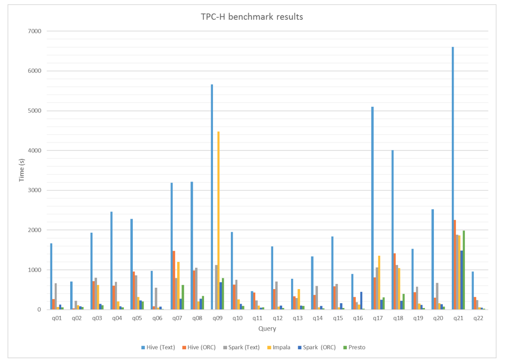

### Benchmarking BigSQL Systems
This master thesis compares Hive, Spark, Presto, Impala as of 2018:

https://comserv.cs.ut.ee/home/files/aluko_software_engineering_2018.pdf?study=ATILoputoo&reference=F329B27E2ACD0736C78FE7E03DD9E6EE3FABC26A




#### Benchmark Queries

##### TPC-DS - decision support

99 queries - https://github.com/prestodb/presto/tree/master/presto-benchto-benchmarks/src/main/resources/sql/presto/tpcds


##### TPC-H - ad-hoc query

22 queries - https://github.com/prestodb/presto/tree/master/presto-benchto-benchmarks/src/main/resources/sql/presto/tpch

### Ahana docker sandbox

see /home/wengong/projects/py4kids/lesson-17-pyspark/HELK/HELK.README.md and make sure to stop running HELK image
```
cd ~/projects/HELK/docker/
sudo docker-compose -f helk-kibana-notebook-analysis-alert-basic.yml stop
sudo systemctl stop apache2.service
```

- Ahana docker image - https://hub.docker.com/r/ahanaio/prestodb-sandbox
- Tutorial - https://towardsdatascience.com/presto-federated-queries-e8f06db95c29
- Jupyter+Presto - https://ahana.io/integrations/jupyter-and-presto/

```
sudo docker pull ahanaio/prestodb-sandbox
sudo docker run -p 8080:8080 --name presto ahanaio/prestodb-sandbox # Start Presto
sudo docker ps  # check status

sudo docker exec -it presto  presto-cli  # launch presto-cli

presto> show catalogs;
presto> show schemas in tpcds;
presto> use tpcds.sf10;
presto> show tables;
presto:sf10> select * from inventory limit 10;
presto> quit


sudo docker container kill cfa4b9846f5c  # stop container image

```

see benchmark SQL queries: 
https://github.com/prestodb/presto/tree/master/presto-benchto-benchmarks/src/main/resources/sql/presto


### Presto F8-2019 demo

- github - https://github.com/prestodb/f8-2019-demo
- youtube - https://www.youtube.com/watch?v=67gXN5697Vw

need to upgrade to python 3.9
```
// to update anaconda 
conda update conda

conda create --name py39 python=3.9

conda activate py39

```


```
git clone https://github.com/prestodb/f8-2019-demo.git

cd f8-2019-demo

sudo docker-compose up

The docker image failed to build locally


sudo docker exec -it f8-2019-demo_presto_1 bin/presto-cli
 # run presto CLI

```

- Jupyter Notebook at localhost:8888
- Presto UI is available at localhost:8080


### Starburst docker image
https://hub.docker.com/r/starburstdata/presto


### PrestoDB

https://github.com/prestodb/presto


#### local build


[INFO] Installing /home/wengong/projects/bigdata/presto/presto/presto-server-rpm/target/presto-server-rpm-0.264-SNAPSHOT.x86_64.rpm to /home/wengong/.m2/repository/com/facebook/presto/presto-server-rpm/0.264-SNAPSHOT/presto-server-rpm-0.264-SNAPSHOT.rpm

wengong@wengong:~/.m2/repository/com/facebook/presto/presto-server/0.264-SNAPSHOT$ ls -l
total 1178896
-rw-rw-r-- 1 wengong wengong       1090 Oct 10 00:21 maven-metadata-local.xml
-rw-rw-r-- 1 wengong wengong       3414 Oct 10 00:20 presto-server-0.264-SNAPSHOT.jar
-rw-rw-r-- 1 wengong wengong      14284 Oct  9 22:03 presto-server-0.264-SNAPSHOT.pom
-rw-rw-r-- 1 wengong wengong       3542 Oct 10 00:20 presto-server-0.264-SNAPSHOT-sources.jar
-rw-rw-r-- 1 wengong wengong 1207150459 Oct 10 00:21 presto-server-0.264-SNAPSHOT.tar.gz
-rw-rw-r-- 1 wengong wengong        291 Oct 10 00:21 _remote.repositories


cp presto-server-0.264-SNAPSHOT.jar presto-server
chmod a+x presto-server

