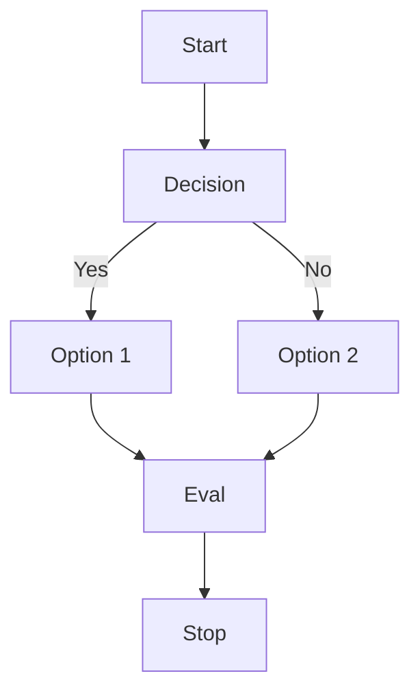
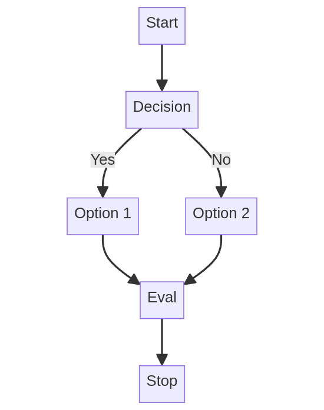

# [Mermaid](https://github.com/mermaid-js/mermaid)

- [Live Editor](https://mermaid.live/)
- [Doc](https://mermaid.js.org/intro/)

generates this diagram

## Examples

- [GitHub demos](https://github.com/mermaid-js/mermaid/tree/develop/demos)
    - local: ~/projects/UI/mermaid/demos
- see mermaind-test.html

- add link to sequence-diagram: https://github.com/mermaid-js/mermaid/issues/1279

## NiceGUI

- https://nicegui.io/documentation/mermaid#mermaid_diagrams

