# GenAI-Powered Multi-Persona Development Platform Vision

## Executive Summary

The evolution from Developer Assist to a comprehensive **GenAI-Powered Multi-Persona Development Platform** represents a strategic transformation that positions your organization as a leader in AI-augmented enterprise productivity. This platform will create a unified ecosystem where Developers, Product Managers, Data Analysts, and Business Analysts can seamlessly collaborate while leveraging role-specific AI capabilities tailored to their unique workflows and methodologies.

## Strategic Vision

### Core Philosophy: "One Platform, Multiple Intelligences"

The platform will operate on the principle that while different roles require specialized tools and methodologies, they share common underlying needs: **intelligent automation, contextual insights, and seamless collaboration**. By building upon your existing MCP architecture, we can create specialized AI agents for each persona while maintaining a unified data layer and shared intelligence.

## Persona-Specific Roadmap

### 1. Developer Persona (Current State + Enhancement)

**Enhanced Capabilities:**
- **Intelligent Code Review Agent**: Beyond basic code analysis, implement contextual code quality assessment using project history, team standards, and industry best practices
- **Automated Technical Debt Management**: AI-driven identification and prioritization of technical debt with refactoring suggestions
- **Smart Dependency Management**: Proactive security vulnerability detection and upgrade path recommendations
- **Context-Aware Documentation**: Auto-generation of technical documentation that stays synchronized with code changes

### 2. Product Manager Persona (Next Phase)

**Discovery & Research:**
- **Market Intelligence Agent**: Automated competitive analysis, feature gap identification, and market trend synthesis
- **User Research Synthesizer**: AI-powered analysis of user interviews, surveys, and feedback to extract actionable insights
- **Opportunity Scoring Engine**: Quantitative assessment of feature requests based on effort, impact, and strategic alignment

**Analysis & Strategy:**
- **Requirements Intelligence**: Natural language processing of stakeholder inputs to generate structured requirements and acceptance criteria
- **Roadmap Optimization Agent**: Dynamic roadmap planning that considers dependencies, resource constraints, and business objectives
- **Persona Journey Mapper**: AI-assisted user journey mapping with pain point identification and solution recommendations

**Solution & Validation:**
- **Prototype Generator**: Rapid wireframe and mockup creation based on requirements and design system patterns
- **A/B Test Designer**: Intelligent experiment design with statistical power calculations and success metrics definition
- **Feature Success Predictor**: ML models that predict feature adoption and business impact based on historical data

### 3. Data Analyst Persona (Parallel Development)

**Data Discovery & Preparation:**
- **Smart Data Profiler**: Automated data quality assessment, schema inference, and anomaly detection
- **ETL Code Generator**: Natural language to SQL/Python transformation with optimization suggestions
- **Data Lineage Mapper**: Automatic tracking of data flows and transformation logic across systems

**Analysis & Insights:**
- **Insight Discovery Engine**: Automated statistical analysis with natural language explanations of findings
- **Visualization Recommender**: Context-aware chart and dashboard suggestions based on data types and business questions
- **Predictive Modeling Assistant**: Guided machine learning model selection, training, and interpretation

**Communication & Reporting:**
- **Executive Summary Generator**: Automated creation of business-friendly reports from technical analysis
- **Dashboard Narrator**: AI-powered storytelling that explains what the data means and why it matters
- **Alert Intelligence**: Smart anomaly detection with contextual explanations and recommended actions

### 4. Business Analyst Persona (Future Phase)

**Requirements Engineering:**
- **Stakeholder Interview Analyzer**: AI-powered extraction of requirements from meeting transcripts and documents
- **Process Mining Agent**: Automated business process discovery and optimization recommendations
- **Gap Analysis Engine**: Systematic identification of process inefficiencies and improvement opportunities

**Business Intelligence:**
- **KPI Intelligence**: Smart metric definition and tracking with industry benchmarking
- **Business Case Generator**: Automated ROI calculations and business justification documents
- **Regulatory Compliance Monitor**: AI-assisted monitoring of regulatory changes and impact assessment

**Solution Design:**
- **Workflow Optimizer**: AI-powered business process redesign with efficiency improvements
- **Change Impact Analyzer**: Comprehensive assessment of proposed changes across systems and processes
- **Training Content Generator**: Automated creation of user guides and training materials

## Technical Architecture Evolution## Implementation Roadmap

### Phase 1: Foundation Enhancement (Months 1-3)
- **Enhanced Developer Tools**: Expand existing capabilities with intelligent code review and technical debt management
- **Unified Data Architecture**: Implement the enhanced data layer with persona-specific storage
- **RAG System Upgrade**: Multi-modal embeddings and cross-reference capabilities

### Phase 2: Product Manager Integration (Months 4-8)
- **Core PM AI Services**: Market intelligence, requirements processing, and roadmap optimization
- **Cross-Persona Workflows**: Developer-PM collaboration features
- **Prototype Generation**: AI-assisted wireframing and mockup creation

### Phase 3: Data Analyst Capabilities (Months 6-10)
- **Data Intelligence Suite**: Smart profiling, ETL generation, and insight discovery
- **Analytics Integration**: Connection to major data platforms and visualization tools
- **Predictive Modeling**: Guided ML model development and deployment

### Phase 4: Business Analyst Integration (Months 9-12)
- **Process Intelligence**: Business process mining and optimization
- **Requirements Engineering**: Advanced stakeholder analysis and documentation
- **Compliance and Governance**: Automated monitoring and reporting

### Phase 5: Advanced Cross-Persona Features (Months 10-15)
- **Unified Collaboration Hub**: Real-time cross-functional project management
- **Enterprise Knowledge Graph**: Comprehensive organizational intelligence
- **Advanced Analytics**: Predictive insights across all personas

## Expected Business Impact

### Quantitative Benefits
- **40-60% reduction** in routine task completion time across all personas
- **25-35% improvement** in cross-functional project delivery speed
- **50-70% decrease** in context switching and information seeking time
- **30-45% increase** in first-time-right deliverable quality

### Qualitative Benefits
- **Enhanced Decision Making**: AI-powered insights enable more informed strategic decisions
- **Improved Collaboration**: Unified platform breaks down silos between functional areas
- **Accelerated Innovation**: Rapid prototyping and validation capabilities
- **Knowledge Democratization**: Enterprise intelligence accessible to all personas
- **Reduced Technical Debt**: Proactive identification and management across the entire development lifecycle

## Risk Mitigation Strategy

### Technical Risks
- **Model Accuracy**: Implement continuous learning and feedback loops
- **Integration Complexity**: Phased rollout with thorough testing at each stage
- **Performance Scaling**: Cloud-native architecture with auto-scaling capabilities

### Organizational Risks
- **Change Management**: Comprehensive training and gradual feature introduction
- **Data Privacy**: Enterprise-grade security and compliance measures
- **User Adoption**: Persona-specific onboarding and success metrics

## Success Metrics

### Platform Metrics
- Active users per persona segment
- Feature adoption rates across different roles
- Cross-persona collaboration frequency
- Platform uptime and performance benchmarks

### Business Metrics
- Time-to-market improvements for new features/products
- Quality metrics (defect rates, rework requirements)
- Employee satisfaction and productivity scores
- ROI measurement across different persona use cases

This vision transforms your Developer Assist platform into a comprehensive **GenAI-Powered Enterprise Productivity Platform** that not only serves multiple personas but creates synergistic value through their intelligent integration. The platform becomes a competitive advantage by enabling your organization to operate at the speed of AI while maintaining human creativity and strategic thinking at the center of all decisions.

```mermaid
graph TB
    subgraph "Unified Interface Layer"
        UI[Universal Dashboard]
        DEV_UI[Developer Workspace]
        PM_UI[Product Manager Workspace]
        DA_UI[Data Analyst Workspace]
        BA_UI[Business Analyst Workspace]
        COLLAB[Collaboration Hub]
    end

    subgraph "AI Orchestration Engine"
        ROUTER[Persona-Aware Query Router]
        CONTEXT[Context Manager]
        WORKFLOW[Workflow Orchestrator]
        INTEGRATION[Cross-Persona Integration]
    end

    subgraph "Developer AI Services"
        CODE_AGENT[Code Review Agent]
        TECH_DEBT[Technical Debt Manager]
        DOC_GEN[Documentation Generator]
        DEP_MANAGER[Dependency Manager]
    end

    subgraph "Product Manager AI Services"
        MARKET_INTEL[Market Intelligence Agent]
        REQ_INTEL[Requirements Intelligence]
        ROADMAP_OPT[Roadmap Optimizer]
        PROTO_GEN[Prototype Generator]
        AB_DESIGNER[A/B Test Designer]
    end

    subgraph "Data Analyst AI Services"
        DATA_PROFILER[Smart Data Profiler]
        ETL_GEN[ETL Code Generator]
        INSIGHT_ENGINE[Insight Discovery Engine]
        VIZ_REC[Visualization Recommender]
        PRED_MODEL[Predictive Modeling Assistant]
    end

    subgraph "Business Analyst AI Services"
        PROCESS_MINER[Process Mining Agent]
        REQ_ANALYZER[Requirements Analyzer]
        KPI_INTEL[KPI Intelligence]
        WORKFLOW_OPT[Workflow Optimizer]
        COMPLIANCE[Compliance Monitor]
    end

    subgraph "Enhanced RAG System"
        MULTI_EMBED[Multi-Modal Embeddings]
        PERSONA_KB[Persona-Specific Knowledge Base]
        CROSS_REF[Cross-Reference Engine]
        DOMAIN_MODELS[Domain-Specific Models]
    end

    subgraph "Extended LLM Layer"
        SPECIALIST_LLMS[Specialized LLMs<br/>Code, Product, Analytics, Business]
        MULTI_MODAL[Multi-Modal Models<br/>Text, Code, Images, Data]
        FINE_TUNED[Fine-Tuned Models<br/>Company-Specific]
    end

    subgraph "Enhanced MCP Server Layer"
        MCP_CORE[Enhanced MCP Core]
        DEV_TOOLS[Developer Tools<br/>Git, JIRA, CI/CD]
        PM_TOOLS[Product Tools<br/>Analytics, Survey, Prototype]
        DATA_TOOLS[Data Tools<br/>SQL, ETL, ML Platforms]
        BIZ_TOOLS[Business Tools<br/>CRM, ERP, Workflow]
        SHARED_TOOLS[Shared Tools<br/>Communication, Document]
    end

    subgraph "Intelligent Data Layer"
        UNIFIED_DB[Unified Data Warehouse]
        PERSONA_DATA[Persona-Specific Datastores]
        ACTIVITY_LOG[Activity & Learning Log]
        KNOWLEDGE_GRAPH[Enterprise Knowledge Graph]
        CACHE_LAYER[Intelligent Caching Layer]
    end

    subgraph "External Integration Layer"
        API_GATEWAY[API Gateway & Authentication]
        ENTERPRISE_APIS[Enterprise System APIs]
        CLOUD_SERVICES[Cloud AI Services]
        THIRD_PARTY[Third-Party Integrations]
    end

    %% User Interface Flow
    UI --> DEV_UI
    UI --> PM_UI
    UI --> DA_UI
    UI --> BA_UI
    UI --> COLLAB

    %% Query Routing
    DEV_UI --> ROUTER
    PM_UI --> ROUTER
    DA_UI --> ROUTER
    BA_UI --> ROUTER
    COLLAB --> ROUTER

    %% AI Orchestration
    ROUTER --> CONTEXT
    CONTEXT --> WORKFLOW
    WORKFLOW --> INTEGRATION

    %% Persona-Specific Services
    ROUTER --> CODE_AGENT
    ROUTER --> MARKET_INTEL
    ROUTER --> DATA_PROFILER
    ROUTER --> PROCESS_MINER

    %% AI Service Details
    CODE_AGENT --> TECH_DEBT
    CODE_AGENT --> DOC_GEN
    CODE_AGENT --> DEP_MANAGER

    MARKET_INTEL --> REQ_INTEL
    MARKET_INTEL --> ROADMAP_OPT
    MARKET_INTEL --> PROTO_GEN
    MARKET_INTEL --> AB_DESIGNER

    DATA_PROFILER --> ETL_GEN
    DATA_PROFILER --> INSIGHT_ENGINE
    DATA_PROFILER --> VIZ_REC
    DATA_PROFILER --> PRED_MODEL

    PROCESS_MINER --> REQ_ANALYZER
    PROCESS_MINER --> KPI_INTEL
    PROCESS_MINER --> WORKFLOW_OPT
    PROCESS_MINER --> COMPLIANCE

    %% RAG Integration
    WORKFLOW --> MULTI_EMBED
    MULTI_EMBED --> PERSONA_KB
    PERSONA_KB --> CROSS_REF
    CROSS_REF --> DOMAIN_MODELS

    %% LLM Layer
    WORKFLOW --> SPECIALIST_LLMS
    SPECIALIST_LLMS --> MULTI_MODAL
    MULTI_MODAL --> FINE_TUNED

    %% MCP Integration
    WORKFLOW --> MCP_CORE
    MCP_CORE --> DEV_TOOLS
    MCP_CORE --> PM_TOOLS
    MCP_CORE --> DATA_TOOLS
    MCP_CORE --> BIZ_TOOLS
    MCP_CORE --> SHARED_TOOLS

    %% Data Flow
    MCP_CORE --> UNIFIED_DB
    UNIFIED_DB --> PERSONA_DATA
    PERSONA_DATA --> ACTIVITY_LOG
    ACTIVITY_LOG --> KNOWLEDGE_GRAPH
    KNOWLEDGE_GRAPH --> CACHE_LAYER

    %% External Integration
    MCP_CORE --> API_GATEWAY
    API_GATEWAY --> ENTERPRISE_APIS
    API_GATEWAY --> CLOUD_SERVICES
    API_GATEWAY --> THIRD_PARTY

    %% Cross-Persona Collaboration
    INTEGRATION --> COLLAB
    KNOWLEDGE_GRAPH --> INTEGRATION

    %% Styling
    classDef uiLayer fill:#e1f5fe,stroke:#01579b,stroke-width:2px
    classDef orchestrationLayer fill:#f3e5f5,stroke:#4a148c,stroke-width:2px
    classDef devLayer fill:#e8f5e8,stroke:#1b5e20,stroke-width:2px
    classDef pmLayer fill:#fff3e0,stroke:#e65100,stroke-width:2px
    classDef dataLayer fill:#fce4ec,stroke:#880e4f,stroke-width:2px
    classDef bizLayer fill:#f1f8e9,stroke:#33691e,stroke-width:2px
    classDef ragLayer fill:#fff8e1,stroke:#f57f17,stroke-width:2px
    classDef llmLayer fill:#ffebee,stroke:#c62828,stroke-width:2px
    classDef mcpLayer fill:#e3f2fd,stroke:#0277bd,stroke-width:2px
    classDef dbLayer fill:#f9fbe7,stroke:#689f38,stroke-width:2px
    classDef externalLayer fill:#fafafa,stroke:#424242,stroke-width:2px

    class UI,DEV_UI,PM_UI,DA_UI,BA_UI,COLLAB uiLayer
    class ROUTER,CONTEXT,WORKFLOW,INTEGRATION orchestrationLayer
    class CODE_AGENT,TECH_DEBT,DOC_GEN,DEP_MANAGER devLayer
    class MARKET_INTEL,REQ_INTEL,ROADMAP_OPT,PROTO_GEN,AB_DESIGNER pmLayer
    class DATA_PROFILER,ETL_GEN,INSIGHT_ENGINE,VIZ_REC,PRED_MODEL dataLayer
    class PROCESS_MINER,REQ_ANALYZER,KPI_INTEL,WORKFLOW_OPT,COMPLIANCE bizLayer
    class MULTI_EMBED,PERSONA_KB,CROSS_REF,DOMAIN_MODELS ragLayer
    class SPECIALIST_LLMS,MULTI_MODAL,FINE_TUNED llmLayer
    class MCP_CORE,DEV_TOOLS,PM_TOOLS,DATA_TOOLS,BIZ_TOOLS,SHARED_TOOLS mcpLayer
    class UNIFIED_DB,PERSONA_DATA,ACTIVITY_LOG,KNOWLEDGE_GRAPH,CACHE_LAYER dbLayer
    class API_GATEWAY,ENTERPRISE_APIS,CLOUD_SERVICES,THIRD_PARTY externalLayer

```

### Solution Archtecture diagram

This layered architecture diagram illustrates the **platform-as-a-service approach** where:

## **Horizontal Layers (Shared Platform Services)**

### **L1: User Interface & Experience Layer**
- **Unified Portal**: Single entry point with role-based views
- **Collaboration Hub**: Cross-persona communication and project coordination
- **Personalization Engine**: Adaptive interfaces based on user behavior and preferences

### **L2: Agent Orchestration Layer**
- **Agent Registry**: Discovery and management of all available AI agents
- **Multi-Agent Orchestrator**: Coordinates complex workflows involving multiple agents
- **Workflow Engine**: Executes business processes across different personas

### **L3: Query Processing & Routing Layer**
- **Natural Language Parser**: Understands user intents in natural language
- **Intent Classifier**: Determines the type of request and required capabilities
- **Persona-Aware Router**: Routes requests to appropriate persona-specific solutions

### **L4: Planning & Reasoning Layer**
- **Strategic Planner**: High-level planning for complex, multi-step tasks
- **Task Decomposer**: Breaks down complex requests into executable subtasks
- **Dependency Resolver**: Manages task dependencies and execution order

### **L5: Memory & Knowledge Layer**
- **Knowledge Vector Store**: Centralized repository of organizational knowledge
- **Enterprise Knowledge Graph**: Semantic relationships between entities, processes, and concepts
- **Continuous Learning Engine**: Adapts and improves based on user interactions

### **L6: LLM & AI Models Layer**
- **Foundation Models**: Large language models for general reasoning
- **Specialized Models**: Domain-specific models for code, analytics, and business processes
- **Fine-Tuned Models**: Company-specific adaptations for organizational context

### **L7: Tool Integration Layer (MCP)**
- **MCP Server Core**: Protocol implementation for tool integration
- **Tool Registry**: Catalog of available tools and their capabilities
- **Security Gateway**: Authentication and authorization for tool access

### **L8: Data & Integration Layer**
- **Data Connectors**: Integration with enterprise systems and databases
- **API Gateway**: Secure access to external services and APIs
- **Message Broker**: Asynchronous communication between services

### **L9: Infrastructure & Operations Layer**
- **Container Platform**: Scalable deployment and management
- **Observability**: Monitoring, logging, and performance tracking
- **Security & Compliance**: Enterprise-grade security controls

## **Vertical Columns (Persona-Specific Solutions)**

Each persona column consists of four specialized tiers that leverage the shared horizontal services:

1. **UI Layer**: Role-specific interfaces and dashboards
2. **Agent Layer**: Specialized AI agents for persona-specific tasks
3. **Workflow Layer**: Business process automation tailored to each role
4. **Tool Layer**: Integration with role-specific tools and systems

## **Key Architectural Benefits**

### **Platform Efficiency**
- **Shared Infrastructure**: Common services reduce development overhead and maintenance costs
- **Reusable Components**: Core capabilities like LLMs and knowledge stores serve all personas
- **Consistent Experience**: Unified interface patterns across different roles

### **Persona Specialization**
- **Tailored Solutions**: Each vertical column addresses specific persona needs and workflows
- **Specialized Agents**: Role-specific AI agents with deep domain expertise
- **Custom Integrations**: Direct connections to tools and systems each persona uses daily

### **Cross-Persona Collaboration**
- **Unified Knowledge**: Shared knowledge graph enables cross-functional insights
- **Collaborative Workflows**: Multi-persona processes can be orchestrated seamlessly
- **Consistent Context**: Conversations and projects maintain context across different roles

### **Scalability and Extensibility**
- **Easy Expansion**: New personas can be added by creating new vertical columns
- **Platform Evolution**: Horizontal layers can be enhanced to benefit all personas simultaneously
- **Modular Architecture**: Individual components can be upgraded or replaced independently

This architecture ensures that while each persona gets specialized capabilities, they all benefit from shared platform investments and can collaborate effectively within a unified ecosystem.

```mermaid
graph TB
    subgraph "PERSONA-SPECIFIC SOLUTION LAYERS (Vertical Columns)"
        subgraph "Developer Solutions"
            DEV_UI[Developer IDE<br/>Integration]
            DEV_AGENTS[Code Review Agent<br/>Tech Debt Agent<br/>Documentation Agent]
            DEV_WORKFLOWS[CI/CD Workflows<br/>Code Quality Gates<br/>Security Scanning]
            DEV_TOOLS[Git Integration<br/>JIRA Connector<br/>Build Systems]
        end

        subgraph "Product Manager Solutions"
            PM_UI[Product Dashboard<br/>Roadmap Views]
            PM_AGENTS[Market Research Agent<br/>Requirements Agent<br/>Roadmap Agent]
            PM_WORKFLOWS[Discovery Process<br/>Validation Cycles<br/>Launch Planning]
            PM_TOOLS[Analytics Tools<br/>Survey Platforms<br/>Prototype Tools]
        end

        subgraph "Data Analyst Solutions"
            DA_UI[Analytics Workbench<br/>Visualization Studio]
            DA_AGENTS[Data Profiling Agent<br/>Insight Discovery Agent<br/>ML Assistant Agent]
            DA_WORKFLOWS[ETL Pipelines<br/>Analysis Workflows<br/>Reporting Cycles]
            DA_TOOLS[SQL Engines<br/>BI Platforms<br/>ML Frameworks]
        end

        subgraph "Business Analyst Solutions"
            BA_UI[Process Designer<br/>Requirements Portal]
            BA_AGENTS[Process Mining Agent<br/>Requirements Agent<br/>Compliance Agent]
            BA_WORKFLOWS[Process Analysis<br/>Requirements Gathering<br/>Change Management]
            BA_TOOLS[Process Mining<br/>Documentation Tools<br/>Workflow Engines]
        end
    end

    subgraph "SHARED PLATFORM LAYERS (Horizontal Services)"
        subgraph "L1: User Interface & Experience Layer"
            UNIFIED_UI[Unified Portal Interface]
            COLLAB_HUB[Collaboration Hub]
            NOTIFICATION[Notification System]
            PERSONALIZATION[Personalization Engine]
        end

        subgraph "L2: Agent Orchestration Layer"
            AGENT_REGISTRY[Agent Registry & Discovery]
            ORCHESTRATOR[Multi-Agent Orchestrator]
            WORKFLOW_ENGINE[Workflow Execution Engine]
            TASK_SCHEDULER[Task Scheduler & Queue]
        end

        subgraph "L3: Query Processing & Routing Layer"
            QUERY_PARSER[Natural Language Parser]
            INTENT_CLASSIFIER[Intent Classification]
            PERSONA_ROUTER[Persona-Aware Router]
            CONTEXT_MANAGER[Context & Session Manager]
        end

        subgraph "L4: Planning & Reasoning Layer"
            STRATEGIC_PLANNER[Strategic Planning Engine]
            TASK_DECOMPOSER[Task Decomposition]
            DEPENDENCY_RESOLVER[Dependency Resolution]
            EXECUTION_PLANNER[Execution Planning]
        end

        subgraph "L5: Memory & Knowledge Layer"
            VECTOR_STORE[Knowledge Vector Store<br/>Multi-Modal Embeddings]
            MEMORY_MANAGER[Conversational Memory]
            KNOWLEDGE_GRAPH[Enterprise Knowledge Graph]
            LEARNING_ENGINE[Continuous Learning Engine]
        end

        subgraph "L6: LLM & AI Models Layer"
            FOUNDATION_LLMS[Foundation LLMs<br/>GPT-4, Claude, Gemini]
            SPECIALIZED_MODELS[Specialized Models<br/>Code, Analytics, Domain]
            EMBEDDING_MODELS[Embedding Models<br/>Text, Code, Multimodal]
            FINE_TUNED[Fine-Tuned Models<br/>Company-Specific]
        end

        subgraph "L7: Tool Integration Layer (MCP)"
            MCP_SERVER[MCP Server Core]
            TOOL_REGISTRY[Tool Registry & Discovery]
            PROTOCOL_ADAPTERS[Protocol Adapters]
            SECURITY_GATEWAY[Security & Auth Gateway]
        end

        subgraph "L8: Data & Integration Layer"
            DATA_CONNECTORS[Data Source Connectors]
            API_GATEWAY[Enterprise API Gateway]
            MESSAGE_BROKER[Event & Message Broker]
            CACHE_LAYER[Distributed Cache Layer]
        end

        subgraph "L9: Infrastructure & Operations Layer"
            CONTAINER_PLATFORM[Container Orchestration]
            MONITORING[Observability & Monitoring]
            SECURITY[Security & Compliance]
            SCALING[Auto-Scaling & Load Balancing]
        end
    end

    %% Vertical Dependencies (Persona-Specific)
    DEV_UI --> DEV_AGENTS
    DEV_AGENTS --> DEV_WORKFLOWS
    DEV_WORKFLOWS --> DEV_TOOLS

    PM_UI --> PM_AGENTS
    PM_AGENTS --> PM_WORKFLOWS
    PM_WORKFLOWS --> PM_TOOLS

    DA_UI --> DA_AGENTS
    DA_AGENTS --> DA_WORKFLOWS
    DA_WORKFLOWS --> DA_TOOLS

    BA_UI --> BA_AGENTS
    BA_AGENTS --> BA_WORKFLOWS
    BA_WORKFLOWS --> BA_TOOLS

    %% Horizontal Dependencies (Shared Platform)
    UNIFIED_UI --> AGENT_REGISTRY
    AGENT_REGISTRY --> QUERY_PARSER
    QUERY_PARSER --> STRATEGIC_PLANNER
    STRATEGIC_PLANNER --> VECTOR_STORE
    VECTOR_STORE --> FOUNDATION_LLMS
    FOUNDATION_LLMS --> MCP_SERVER
    MCP_SERVER --> DATA_CONNECTORS
    DATA_CONNECTORS --> CONTAINER_PLATFORM

    %% Cross-Layer Integration (Persona Solutions to Shared Platform)
    DEV_UI -.-> UNIFIED_UI
    PM_UI -.-> UNIFIED_UI
    DA_UI -.-> UNIFIED_UI
    BA_UI -.-> UNIFIED_UI

    DEV_AGENTS -.-> ORCHESTRATOR
    PM_AGENTS -.-> ORCHESTRATOR
    DA_AGENTS -.-> ORCHESTRATOR
    BA_AGENTS -.-> ORCHESTRATOR

    DEV_WORKFLOWS -.-> WORKFLOW_ENGINE
    PM_WORKFLOWS -.-> WORKFLOW_ENGINE
    DA_WORKFLOWS -.-> WORKFLOW_ENGINE
    BA_WORKFLOWS -.-> WORKFLOW_ENGINE

    DEV_TOOLS -.-> MCP_SERVER
    PM_TOOLS -.-> MCP_SERVER
    DA_TOOLS -.-> MCP_SERVER
    BA_TOOLS -.-> MCP_SERVER

    %% Shared Services Interconnections
    COLLAB_HUB <--> ORCHESTRATOR
    PERSONA_ROUTER <--> CONTEXT_MANAGER
    KNOWLEDGE_GRAPH <--> VECTOR_STORE
    TOOL_REGISTRY <--> MCP_SERVER
    MESSAGE_BROKER <--> API_GATEWAY

    %% Styling
    classDef devColumn fill:#e8f5e8,stroke:#1b5e20,stroke-width:3px
    classDef pmColumn fill:#fff3e0,stroke:#e65100,stroke-width:3px
    classDef dataColumn fill:#fce4ec,stroke:#880e4f,stroke-width:3px
    classDef bizColumn fill:#f1f8e9,stroke:#33691e,stroke-width:3px
    
    classDef layer1 fill:#e1f5fe,stroke:#01579b,stroke-width:2px
    classDef layer2 fill:#f3e5f5,stroke:#4a148c,stroke-width:2px
    classDef layer3 fill:#fff8e1,stroke:#f57f17,stroke-width:2px
    classDef layer4 fill:#ffebee,stroke:#c62828,stroke-width:2px
    classDef layer5 fill:#e8f5e8,stroke:#2e7d32,stroke-width:2px
    classDef layer6 fill:#fff3e0,stroke:#ef6c00,stroke-width:2px
    classDef layer7 fill:#e3f2fd,stroke:#1565c0,stroke-width:2px
    classDef layer8 fill:#f9fbe7,stroke:#689f38,stroke-width:2px
    classDef layer9 fill:#fafafa,stroke:#616161,stroke-width:2px

    %% Persona Column Styling
    class DEV_UI,DEV_AGENTS,DEV_WORKFLOWS,DEV_TOOLS devColumn
    class PM_UI,PM_AGENTS,PM_WORKFLOWS,PM_TOOLS pmColumn
    class DA_UI,DA_AGENTS,DA_WORKFLOWS,DA_TOOLS dataColumn
    class BA_UI,BA_AGENTS,BA_WORKFLOWS,BA_TOOLS bizColumn

    %% Layer Styling
    class UNIFIED_UI,COLLAB_HUB,NOTIFICATION,PERSONALIZATION layer1
    class AGENT_REGISTRY,ORCHESTRATOR,WORKFLOW_ENGINE,TASK_SCHEDULER layer2
    class QUERY_PARSER,INTENT_CLASSIFIER,PERSONA_ROUTER,CONTEXT_MANAGER layer3
    class STRATEGIC_PLANNER,TASK_DECOMPOSER,DEPENDENCY_RESOLVER,EXECUTION_PLANNER layer4
    class VECTOR_STORE,MEMORY_MANAGER,KNOWLEDGE_GRAPH,LEARNING_ENGINE layer5
    class FOUNDATION_LLMS,SPECIALIZED_MODELS,EMBEDDING_MODELS,FINE_TUNED layer6
    class MCP_SERVER,TOOL_REGISTRY,PROTOCOL_ADAPTERS,SECURITY_GATEWAY layer7
    class DATA_CONNECTORS,API_GATEWAY,MESSAGE_BROKER,CACHE_LAYER layer8
    class CONTAINER_PLATFORM,MONITORING,SECURITY,SCALING layer9

```

