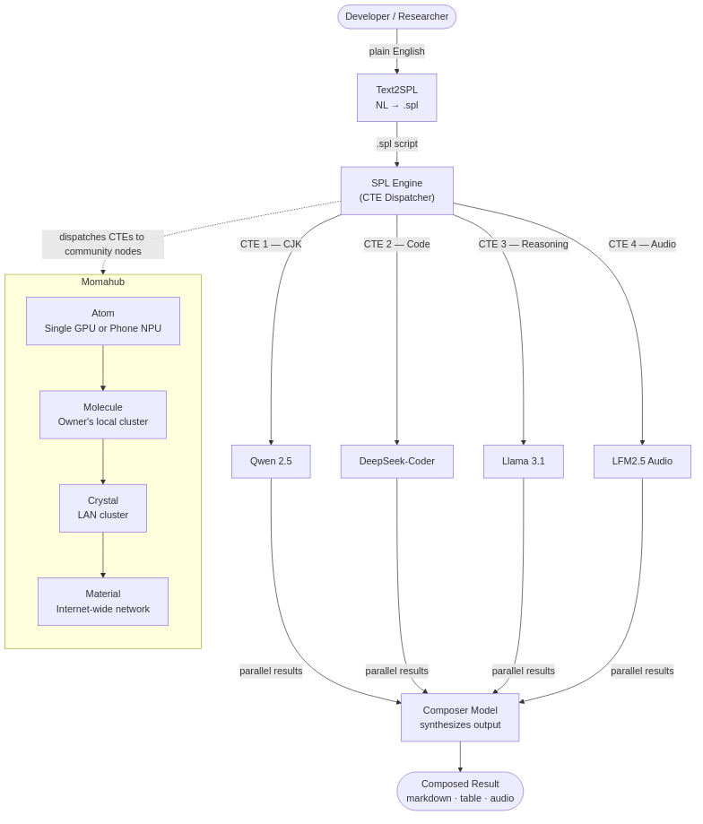

# The Momahub Moment: We Have a Choice

*by Wen G. Gong — March 2026*

---

> *Momahub: **M**ixture **o**f **M**odels on Ollam**a**.*
>
> *A distributed AI inference network where GPU owners
> contribute compute, earn rewards, and keep AI accessible —
> modelled after the economics of Uber and Airbnb,
> the technical architecture of [SETI@home](https://setiathome.berkeley.edu/) and [BOINC](https://boinc.berkeley.edu/),
> and the open-source ethos of GNU/Linux.*
>
> *We the users have a choice. We do not have to wait.*
>
---

## Physics Labs and the Infrastructure of Human Connection

There is a pattern in the history of technology that almost nobody talks about.

The most transformative public infrastructure of the modern era — the
infrastructure that democratized entire domains of human activity — did not
come from commercial incentive. It came from **physics labs**.

In 1989, [Tim Berners-Lee](https://en.wikipedia.org/wiki/Tim_Berners-Lee) was a software engineer at [**CERN**](https://home.cern/) — the European
particle physics laboratory in Geneva. The problem he was trying to solve was
mundane: physicists at CERN generated enormous amounts of data and struggled
to share it across institutions, computers, and continents. His proposal was
called ["Information Management: A Proposal"](https://www.w3.org/History/1989/proposal.html). His supervisor's response, written
in the margin: *"Vague but exciting."*

That vague, exciting proposal became the **World Wide Web**.

CERN did not set out to build the infrastructure of human knowledge. It set out
to study quarks. The Web was a side effect — an act of physics-lab
problem-solving that happened to change everything.

A decade later, in 1999, another physics lab did it again.

---

## A Memory from Berkeley, 1999

I was a physics post-doc at [**Lawrence Berkeley National Laboratory**](https://www.lbl.gov/) —
the same institution that discovered plutonium, built the first cyclotron,
and gave the world the standard model of particle physics — when [SETI@home](https://setiathome.berkeley.edu/)
launched in May 1999.

The idea was almost absurdly simple: the search for extraterrestrial intelligence
required an enormous amount of signal processing — more than any single university
computing cluster could handle. So Berkeley asked for help. Not people's money.
Not their expertise. Just their **idle CPU cycles**.

Five million people said yes.

Their screensavers flickered to life with visualizations of radio telescope data
being crunched in the background — while people slept, while they made coffee,
while they were in meetings. Over 21 years, those contributing computers collectively
processed data that no institution could have afforded to process alone.

In January 2026, the Berkeley team announced that this community-powered analysis
had winnowed [**12 billion detections down to 100 candidate signals**](https://setiathome.berkeley.edu/) — now being
followed up with China's FAST telescope, the most sensitive radio telescope ever built.

The contributors did real science. The model worked.

I was inside that lab when it launched. I watched it happen.

I have been thinking about that moment a lot lately. Because I believe something
structurally similar — but economically far more significant — is about to
happen to AI.

---

## The Pattern

[CERN](https://home.cern/) did not build the Web to make money. [LBL](https://www.lbl.gov/) did not build [SETI@home](https://setiathome.berkeley.edu/) to
disrupt the computing industry. In both cases, physicists faced a data problem
that no existing infrastructure could solve — and built something new.

The Web democratized **information**: knowledge that once lived in university
libraries and corporate archives became universally reachable, at near-zero
marginal cost, to anyone with a connection.

SETI@home democratized **scientific computing**: processing power that once
required institutional supercomputers became collectively achievable by
aggregating idle cycles from millions of participants.

But the pattern goes deeper than two examples. In 1983, [Richard Stallman](https://en.wikipedia.org/wiki/Richard_Stallman)
gave up his position at the [MIT AI Lab](https://www.csail.mit.edu/) to launch the [GNU Project](https://www.gnu.org/gnu/manifesto.html) — the
founding act of the open-source software movement. His manifesto, published
in 1985, made a case that software itself should be a commons: auditable,
improvable, and redistributable by anyone. He was not building a product.
He was building a principle.

I arrived in the United States in 1985 — the same year that manifesto
appeared. Reading Stallman's story planted something. I watched Linux follow
from it. Then Apache, MySQL, PostgreSQL. A generation of open-source
infrastructure emerged and became the silent foundation under almost
everything we use.

GNU/Linux democratized the **operating system**: the software layer that
once ran only on machines you licensed from IBM or Sun became collectively
buildable, ownable, and freely redistributable.

All three revolutions followed the same logic: the asset already existed
(knowledge, computing cycles, software), scattered and underutilized or
artificially restricted. The innovation was a **protocol** — a coordination
layer, or a legal framework, or a distributed network — that made the latent
value collectively accessible.

We are not starting from scratch. We are a molecule in a cluster that has
been building for forty years.

---

## The Problem Worth Solving

The AI industry is building the most expensive infrastructure in human history.

Frontier AI labs — [OpenAI](https://openai.com/), [Google DeepMind](https://deepmind.google/), [Anthropic](https://www.anthropic.com/), [Meta AI](https://ai.meta.com/) — are racing to
build ever-larger models that require ever-larger context windows, which require
ever-larger data centers, which require ever-larger energy budgets. [Microsoft](https://www.microsoft.com/) and
[OpenAI](https://openai.com/) announced a $500 billion data center investment. Governments are writing
energy policy around AI power consumption. The [MIT Sloan AI/Tech Summit](https://www.mitsloantechsummit.com/) I attended
in early 2026 had "Energy Bottleneck" as its central theme.

The result: AI capability is rationed by ability to pay. You bring your data
to their compute. You pay per token. You depend on their uptime, their pricing,
their terms of service.

---

## The Scenario We Must Not Wait For

In February 2026, Citrini Research published a thought exercise called
["The 2028 Global Intelligence Crisis"](https://www.citriniresearch.com/p/2028gic)
— a fictional macro memo written from June 2028, looking back at how everything
went wrong. It is not a prediction. It is a scenario. And it should keep you
up at night.

The thesis: AI works. It works so well that it triggers a negative feedback
loop with no natural brake. Companies adopt AI agents that are faster, cheaper,
and more reliable than white-collar workers. Margins expand. Stocks rally.
Corporate profits reach record highs.

The result: **Ghost GDP** — output that shows up in national accounts but
never circulates through the real economy.

---

## The Gamers Who Built Nvidia

[Nvidia](https://www.nvidia.com/) is today the most valuable company on Earth, worth over $3 trillion.
How did it get here? Not through data centers. Through **gamers**.

The people who built Nvidia's business already own the hardware. What they
lack is a coordination layer that lets them **put that hardware to work —
and earn from it.**

There are an estimated **50–100 million consumer GPUs** in gaming PCs and
workstations worldwide right now. RTX 4070s, 4080s, 4090s, GTX 1080 Tis,
M2 and M3 MacBooks. They are already purchased. They are already powered on.
They are already drawing electricity whether their owners use them or not.

And every one of them can run [Ollama](https://ollama.com/).

---

## We Have a Choice

There is another path — one where the compute is distributed, where GPU
owners are participants rather than casualties, where the value created by
AI inference flows to millions of households rather than a handful of data
center operators.

The infrastructure for that path already exists:

1. **Open-weight models** — [Llama](https://llama.meta.com/), [Qwen](https://github.com/QwenLM/Qwen), [Mistral](https://mistral.ai/), [DeepSeek](https://www.deepseek.com/) *(already here)*
2. **A local inference runtime** — [Ollama](https://ollama.com/) *(already here)*
3. **50–100 million consumer GPUs** — in gaming PCs worldwide *(already purchased)*
4. **A declarative orchestration layer** — [SPL](https://arxiv.org/abs/2602.21257) *(available now, open-source)*
5. **A coordination and reward platform** — [Momahub](https://pypi.org/project/momahub/) *(v0.2.2 published to PyPI)*

We do not need permission from [Nvidia](https://www.nvidia.com/), or [OpenAI](https://openai.com/), or any frontier lab. We
do not need to wait for government policy. We do not need new hardware. We
need a protocol that connects what already exists.

We propose [Momahub](https://pypi.org/project/momahub/) as that coordination protocol and community layer —
one more step in a tradition forty years in the making, not the first act,
but hopefully a meaningful continuation.

---

## Proven Performance: The 3-GPU Milestone

This isn't just theory. On **March 8, 2026**, we validated the Momahub architecture
in a real-world LAN deployment. Two **NVIDIA GTX 1080 Ti** (11GB VRAM each) and
one **NVIDIA GTX 1050 Ti** (4GB VRAM) ran as a three-node grid — hub-and-spoke,
fully automated — with **14/14 cookbook recipes completing successfully**.

Here are measured results from the run:

| Recipe | What it demonstrates | Key metric |
|--------|----------------------|------------|
| Single-node hello | Basic dispatch | 110 tokens, 2.6s |
| Multi-CTE parallel | Fan-out to two CTEs | 181 tokens, 18.3s |
| Batch translate | 4 languages in parallel | wall-clock 4.6s |
| Benchmark models | llama3 / mistral / phi3 | 8.1s for 344 tokens |
| RAG on grid | Retrieval-augmented generation | 334 tokens, 13.3s |
| Stress test | High-volume burst | **37 tokens/s sustained** |
| Model arena | Side-by-side model race | **phi3 peaked at 60.4 tps** |
| Chain relay | 3-step reasoning pipeline | 1,805 tokens across 2 agents, 41.5s |
| Multi-agent throughput | 30 tasks, 2 agents | **3,367 tokens at 46.7 tok/s** |
| Smart router | Keyword-to-model routing | 6/6 prompts routed (mathstral / qwen2.5-coder / llama3) |
| Privacy chunk demo | Document split across agents | 3 chunks, no agent sees full doc, 25.8s |
| Compiler pipeline | 5-stage NL→SPL pipeline | 683 tokens, 25.2s, 5 steps |

The nodes didn't just contribute — they functioned as a coherent, programmable
compute surface. Load was automatically balanced between a PLATINUM-tier and a
GOLD-tier node with zero manual configuration.

The full cookbook with source code and logs is available at:
[github.com/digital-duck/momahub.py/tree/main/cookbook](https://github.com/digital-duck/momahub.py/tree/main/cookbook)

---

## What Is Momahub?

Momahub — **Mixture of Models on Ollama** — is four things braided together:

**MoM — Mixture of Models.**
Specialist models coordinated by a single declarative script.

**Ollama — Open, Privacy-first, Local LLM inference.**
An open-source runtime for open-weight models.

**SPL — Structured Prompt Language.**
The declarative orchestration layer ([arXiv:2602.21257](https://arxiv.org/abs/2602.21257)).

**Momahub — The distributed inference platform.**
Modelled after [Docker Hub](https://hub.docker.com/) and [GitHub](https://github.com/), where owners of *already purchased,
already powered, already idle* GPUs can **participate economically
in the AI transition**.

The diagram below shows how these four layers compose into a full pipeline —
from a plain-English request down to parallel specialist models running across
community nodes at four tiers of scale:



---

## Momahub Rewards: Distributed Prosperity

Momahub Rewards is designed to test a counter-model: what happens when AI compute
value flows to millions of distributed GPU owners instead of a handful of data
center operators?

The economic model is not new. In 2009, [Travis Kalanick and Garrett Camp](https://en.wikipedia.org/wiki/Uber) asked:
what if your car could earn money between trips? In 2008, [Brian Chesky and
Joe Gebbia](https://en.wikipedia.org/wiki/Airbnb) asked: what if your spare room could pay rent? Both companies
unlocked billions of dollars of latent value from assets people already owned.
Momahub asks the same question about the GPU in your gaming PC.

Every time a Momahub node processes an inference task, the hub records the work in
an append-only reward ledger. One credit per 1,000 tokens. No blockchain waste.
The "proof" is the useful inference itself.

---

## The Energy Argument

An RTX 4090 running Llama 3.1 8B uses roughly **150W under load**. An overnight
run (8 hours) consumes 1.2 kWh — about **$0.15** at average US electricity prices.

| Provider | Price per 1K tokens | Cost for 100K tokens |
|----------|---------------------|----------------------|
| GPT-4o | ~$0.01–0.03 | $1,000–$3,000 |
| **RTX 4090 + Ollama** | **~$0.0015** | **~$0.15** |

The consumer GPU is **600× to 6,000× cheaper** for equivalent inference volume.

---

## What the Code Actually Looks Like

SPL is an SQL-inspired language to manage context as resource. 
Here is the script that ran on our 3-GPU grid for the
chain relay recipe — three reasoning steps dispatched automatically across
available agents:

```sql
-- chain.spl: multi-step reasoning pipeline
PROMPT research_chain
USING MODEL 'llama3'
ON GRID
WITH research AS (
    SELECT system_role('You are a research assistant.')
    GENERATE llm('Research the topic: quantum computing. Key facts and trends.')
),
analysis AS (
    SELECT system_role('You are a critical analyst.')
    GENERATE llm('Analyze the key challenges: ' || research.output)
),
summary AS (
    SELECT system_role('You are a concise technical writer.')
    GENERATE llm('Summarize in 3 bullet points: ' || analysis.output)
)
SELECT summary.output;
```

Each CTE (`research`, `analysis`, `summary`) is dispatched as an independent task.
The hub routes each to the best available GPU agent node. The `.spl` file is identical
whether run locally, against a cloud API, or across the community grid. Here, CTE stands for Common Table Expression in SQL standard, it expresses a unit of work in data processing or prompt engineering. 

---

## Where to Start

If you want to run SPL today — on your own machine, with Ollama, at zero cost:

```bash
pip install spl-llm      # SPL engine
pip install spl-flow     # Agentic orchestration layer

ollama pull llama3.1     # One-time model download (~4GB)

spl init
spl execute examples/hello_world.spl
```

If you want to run your own hub node (e.g. on a home server or LAN):

```bash
pip install momahub

# Start a local hub
moma hub up --host 0.0.0.0 --port 8000
```

If you prefer to join an existing public hub instead:

```bash
pip install momahub

# Join a public hub as a contributing agent (requires Ollama running locally)
moma join http://hub.momahub.org:8000 --pull

# Monitor your contribution and credits
moma status
moma rewards

moma --help
```

---

## References

**Open-Source & Historical Movements**

[Richard M. Stallman](https://en.wikipedia.org/wiki/Richard_Stallman), [*The GNU Manifesto*](https://www.gnu.org/gnu/manifesto.html), Dr. Dobb's Journal (March 1985).
*(Stallman announced the GNU Project in September 1983 and resigned from the [MIT AI Lab](https://www.csail.mit.edu/) in January 1984 to pursue it full-time.)*

[Tim Berners-Lee](https://en.wikipedia.org/wiki/Tim_Berners-Lee), [*Information Management: A Proposal*](https://www.w3.org/History/1989/proposal.html), [CERN](https://home.cern/) (March 1989).

UC Berkeley SETI Research Center, [*SETI@home*](https://setiathome.berkeley.edu/) project page and results archive (1999–2026).

**The Gig Economy Precedents**

[Uber](https://en.wikipedia.org/wiki/Uber) — founding story (2009), Travis Kalanick and Garrett Camp, San Francisco.

[Airbnb](https://en.wikipedia.org/wiki/Airbnb) — founding story (2008), Brian Chesky, Joe Gebbia, and Nathan Blecharczyk, San Francisco.

**Blogs, Codes & Papers**

Citrini Research and Alap Shah, [*The 2028 Global Intelligence Crisis: A Thought Exercise in Financial History, from the Future*](https://www.citriniresearch.com/p/2028gic) (February 2026).

Wen G. Gong, [*SPL: Structured Prompt Language for Generative AI*](https://arxiv.org/abs/2602.21257), arXiv:2602.21257 (2026).

[Momahub Cookbook](https://github.com/digital-duck/momahub.py/tree/main/cookbook) — 14 validated recipes with logs and HTML reports, Apache 2.0.

---

**Open-source packages (Apache 2.0):**
- `pip install spl-llm` — SPL engine: https://github.com/digital-duck/SPL
- `pip install spl-flow` — Agentic orchestration: https://github.com/digital-duck/SPL-flow
- `pip install momahub` — Distributed inference hub: https://github.com/digital-duck/momahub.py

---

*Wen G. Gong is a former physics post-doc at Lawrence Berkeley National
Laboratory (LBNL) and a data/AI engineer with 20+ years of experience across
SQL, Oracle, and enterprise data systems. He can be reached at wen.gong.research@gmail.com.*

---

> *We are not building an alternative to frontier AI labs —
> we are building the community layer that makes AI infrastructure more accessible:
> as decentralized as the Internet, as open and cost-free as Linux,
> and as economically inclusive as the Uber economy.*

*© 2026 Wen G. Gong. Licensed under CC BY 4.0. Share freely with attribution.*
