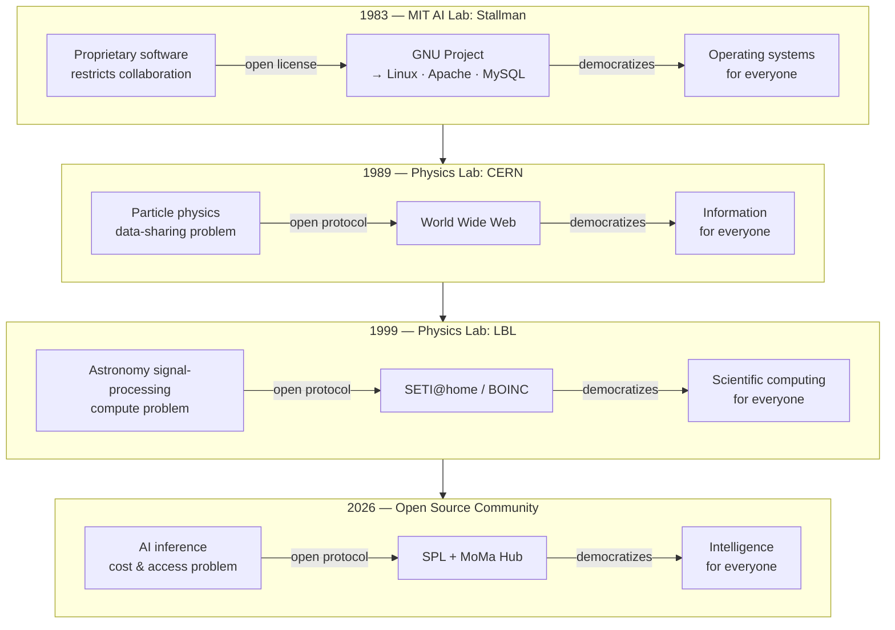
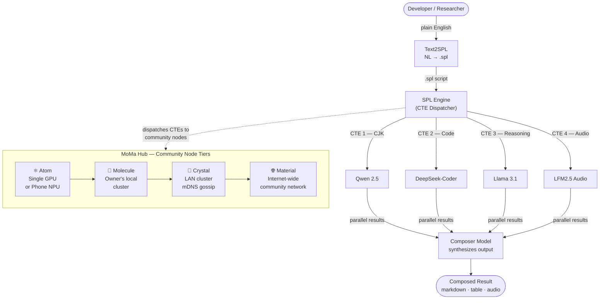

# The MoMa Moment: SETI@home for Democratic AI

*by Wen G. Gong — February 2026*

---

> *MoMa: **M**ixture **o**f **M**odels on Ollam**a**.*
>
> *GPU sharing for accessible, democratic AI —
> modelled after SETI@home (idle CPU cycles for astronomy),
> Uber (idle cars for rides), and Airbnb (idle rooms for travelers).*
>
> *A proposal to make AI inference as open as the Internet made information.*
>
> *Rhymes with MoMA — The Museum of Modern Art. Pure coincidence. Entirely intentional.*

---

## Physics Labs and the Infrastructure of Human Connection

There is a pattern in the history of technology that almost nobody talks about.

The most transformative public infrastructure of the modern era — the
infrastructure that democratized entire domains of human activity — did not
come from commercial incentive. It came from **physics labs**.

In 1989, Tim Berners-Lee was a software engineer at **CERN** — the European
particle physics laboratory in Geneva. The problem he was trying to solve was
mundane: physicists at CERN generated enormous amounts of data and struggled
to share it across institutions, computers, and continents. His proposal was
called "Information Management: A Proposal." His supervisor's response, written
in the margin: *"Vague but exciting."*

That vague, exciting proposal became the **World Wide Web**.

CERN did not set out to build the infrastructure of human knowledge. It set out
to study quarks. The Web was a side effect — an act of physics-lab
problem-solving that happened to change everything.

A decade later, in 1999, another physics lab did it again.

---

## A Memory from Berkeley, 1999

I was a physics post-doc at **Lawrence Berkeley National Laboratory** —
the same institution that discovered plutonium, built the first cyclotron,
and gave the world the standard model of particle physics — when SETI@home
launched in May 1999.

The idea was almost absurdly simple: the search for extraterrestrial intelligence
required an enormous amount of signal processing — more than any single university
computing cluster could handle. So Berkeley asked for volunteers. Not their money.
Not their expertise. Just their **idle CPU cycles**.

Five million people said yes.

Their screensavers flickered to life with visualizations of radio telescope data
being crunched in the background — while people slept, while they made coffee,
while they were in meetings. Over 21 years, those volunteer computers collectively
processed data that no institution could have afforded to process alone.

In January 2026, the Berkeley team announced that this volunteer-powered analysis
had winnowed **12 billion detections down to 100 candidate signals** — now being
followed up with China's FAST telescope, the most sensitive radio telescope ever built.

The volunteers did real science. The model worked.

I was inside that lab when it launched. I watched it happen.

I have been thinking about that moment a lot lately. Because I believe something
structurally identical is about to happen to AI — and physics, once again,
is pointing the way.

---

## The Pattern

CERN did not build the Web to make money. LBL did not build SETI@home to
disrupt the computing industry. In both cases, physicists faced a data problem
that no existing infrastructure could solve — and built something new.

The Web democratized **information**: knowledge that once lived in university
libraries and corporate archives became universally reachable, at near-zero
marginal cost, to anyone with a connection.

SETI@home democratized **scientific computing**: processing power that once
required institutional supercomputers became collectively achievable by
aggregating idle cycles from millions of volunteers.

But the pattern goes deeper than two examples. In 1983, Richard Stallman
gave up his position at the MIT AI Lab to launch the GNU Project — the
founding act of the open-source software movement. His manifesto, published
in 1985, made a case that software itself should be a commons: auditable,
improvable, and redistributable by anyone. He was not building a product.
He was building a principle.

I arrived in the United States in 1985 — the same year that manifesto
appeared. Reading Stallman's story planted something. I watched Linux follow
from it. Then Apache, MySQL, PostgreSQL. A generation of open-source
infrastructure emerged and became the silent foundation under almost
everything we use.

GNU/Linux democratized the **operating system**: the software layer that
once ran only on machines you licensed from IBM or Sun became collectively
buildable, ownable, and freely redistributable.

All three revolutions followed the same logic: the asset already existed
(knowledge, computing cycles, software), scattered and underutilized or
artificially restricted. The innovation was a **protocol** — a coordination
layer, or a legal framework, or a volunteer network — that made the latent
value collectively accessible.

We are not starting from scratch. We are a molecule in a cluster that has
been building for forty years. MoMa Hub is the next layer in that
tradition — not the first act, but the logical continuation.



---

## The Problem Worth Solving

The AI industry is building the most expensive infrastructure in human history.

Frontier AI labs — OpenAI, Google DeepMind, Anthropic, Meta — are racing to
build ever-larger models that require ever-larger context windows, which require
ever-larger data centers, which require ever-larger energy budgets. Microsoft and
OpenAI announced a $500 billion data center investment. Governments are writing
energy policy around AI power consumption. The MIT Sloan AI/Tech Summit I attended
in early 2026 had "Energy Bottleneck" as its central theme.

The result: AI capability is rationed by ability to pay. You bring your data
to their compute. You pay per token. You depend on their uptime, their pricing,
their terms of service.

This is a familiar story.

---

## History May Not Repeat, But Rhymes

Every generation, a dominant technology platform creates dependency.
Every generation, an open architecture breaks the cycle.

| Era | The Centralised Platform | The Break-away |
|-----|--------------------------|----------------|
| 1970s–1980s | IBM Mainframe: proprietary hardware + OS, you lease the machine | Minicomputers (DEC), then the personal computer |
| 1983–present | Proprietary software: no source, no sharing, no modification | **GNU Project → Linux · Apache · MySQL** (Stallman's gift) |
| 1990s–2000s | Oracle DB: proprietary SQL dialects, migration costs a decade | MySQL, PostgreSQL + Hadoop, Spark |
| 2000s–2010s | On-premises data centres: CapEx hardware, vendor contracts | Cloud computing: rent elastically, own nothing |
| 2020s–present | Frontier AI Labs: API-only, per-token billing, context window arms race | Open-weight models + **Ollama** + **SPL** |

The break-away pattern is always the same. An open alternative reaches
*good enough* quality at a fraction of the cost. A declarative abstraction layer
— SQL, Hadoop YARN, Kubernetes, now SPL — hides the underlying provider and
makes switching cost near zero.

IBM did not lose to a better mainframe. It lost to a different paradigm: the PC.
Oracle did not lose to a better proprietary database. It lost to open-source
correctness (PostgreSQL) and a new architectural model (Hadoop).

The question is: what sidesteps the frontier-lab API model?

I think the answer is **MoMa**.

---

## What Is MoMa?

MoMa — **Mixture of Models on Ollama** — is four things braided together:

**MoM — Mixture of Models.**
Rather than sending every query to one giant generalist model, you route each
task to the specialist model best suited for it. CJK language tasks go to
Qwen. Code goes to DeepSeek-Coder. Mathematics goes to DeepSeek-R1.
Multi-step reasoning goes to a Claude or Llama reasoning model. A single
declarative script orchestrates all of them, each playing its part like
instruments in an orchestra — an *AI Symphony*.

*(The metaphor is not accidental. Listening to Beethoven's nine symphonies —
each movement with its own distinct character, yet cohering into a unified
whole — is what first planted the image. Each model plays to its strength,
coordinated not by a conductor waving a baton but by the declarative structure
of the `.spl` script itself.)*

**Ollama — Local-first LLM inference.**
Ollama is an open-source runtime that lets you run any of dozens of
open-weight models — Llama 3.1, Qwen 2.5, Mistral, DeepSeek — on your own
hardware. A laptop. A workstation. A gaming PC. No API key. No data leaves your
machine. No per-token billing. The marginal cost of one inference is the
electricity your GPU was already drawing.

**SPL — Structured Prompt Language.**
SPL is the declarative orchestration layer that makes MoM + Ollama compose into
something powerful. It is a SQL-inspired query language for LLM interactions
(arXiv:2602.21257) that lets you write a single `.spl` script to coordinate
multiple specialist models, manage token budgets, split long documents into
parallel chunks, and route the whole pipeline — locally, in the cloud, or across
a hybrid of both — without changing a line of code.

**MoMa Hub — The contribution platform.**
The missing piece that turns individual Ollama nodes into a collective
infrastructure. Modelled after Docker Hub (share configurable runtimes) and
GitHub (share software). MoMa Hub is where anyone can contribute a distributed
inference node — registering their hardware and making their idle GPU available
to the network. The target hardware is deliberately modest: a **GeForce GTX 1080 Ti**
— a 2017-era card with 11 GB VRAM, available second-hand for under \$150 —
can run a 7B parameter specialist model at practical throughput.

MoMa is the union of all four: *declarative multi-model orchestration,
running locally on hardware you already own, contributed and discovered
through an open hub.*



---

## The SETI@home Parallel

Here is the part that excites me most — and that took me back to Berkeley 1999.

Today, one developer running SPL + Ollama on their own GPU can handle complex
multi-model AI workflows overnight at zero marginal cost. That is already
remarkable.

But consider what comes next.

SETI@home did not ask people to buy new hardware. It asked them to donate
**idle cycles on hardware they already owned**. The compute was already there,
sitting unused. BOINC — the open infrastructure Berkeley built — was the
coordination layer that turned millions of idle machines into a coherent
scientific instrument.

Now look around you. There are an estimated **50–100 million consumer GPUs**
in gaming PCs and workstations worldwide — RTX 4070s, 4080s, 4090s, M2 and
M3 MacBooks — sitting largely idle while their owners sleep.

Every one of them can run Ollama.

What is missing is the BOINC-equivalent: a coordination layer that can break
a complex query into chunks, dispatch each chunk to a contributing Ollama node,
collect the results, and synthesize a final answer. SPL's CTE architecture —
where each *Common Table Expression* is an independently executable work unit
— is already structured exactly this way.

This is the **MoMa moment**: the distributed community computing model,
applied to AI inference.

---

## The Technical Foundation

The reason this is architecturally viable — not just a romantic idea — lies in
a simple piece of mathematics.

The attention mechanism in transformer models scales as **O(N²)** with sequence
length N. Sending a 100,000-token document to a single model costs O(N²) in
attention compute. But if you split that document into k chunks of N/k tokens
each, and process them in parallel, the total cost is:

```
O(k × (N/k)²) = O(N²/k)
```

That is a **linear reduction** with the number of chunks. Eight chunks: 8× less
attention compute. Sixteen chunks: 16× less. The math does not care whether
the chunks run on one machine or a thousand.

SPL's Logical Chunking feature formalizes this pattern declaratively. Here is a
simplified example — a research paper analyzed by splitting it into sections,
each processed independently, then synthesized:

```sql
PROMPT analyze_research_paper
WITH BUDGET 32000 tokens
USING MODEL auto    -- each CTE routed to its specialist

WITH chunk_intro AS (
    SELECT context.section_intro AS text LIMIT 3000 tokens
    GENERATE section_summary(text)
    WITH OUTPUT BUDGET 600 tokens
),
chunk_method AS (
    SELECT context.section_method AS text LIMIT 3000 tokens
    GENERATE section_summary(text)
    WITH OUTPUT BUDGET 600 tokens
),
chunk_results AS (
    SELECT context.section_results AS text LIMIT 3000 tokens
    GENERATE section_summary(text)
    WITH OUTPUT BUDGET 600 tokens
)

SELECT
    system_role("You are a thorough research analyst"),
    chunk_intro    AS intro_summary,
    chunk_method   AS method_summary,
    chunk_results  AS results_summary
GENERATE comprehensive_review(intro_summary, method_summary, results_summary)
WITH OUTPUT BUDGET 2000 tokens, FORMAT markdown;
```

The same `.spl` script runs in two modes **without modification**:

- **Parallel (cloud):** CTEs dispatched concurrently via `asyncio.gather`.
  Results in seconds.
- **Sequential (local):** CTEs executed one at a time on a local Ollama instance.
  The same result produced overnight at zero marginal cost.

This is SQL's foundational abstraction applied to AI: the same `SELECT` query
runs on a laptop SQLite database or a distributed cluster. The logical intent
is unchanged; only the physical execution engine differs.

Now extend "local Ollama" to "distributed Ollama community nodes" and you have
SETI@home for AI inference.

---

## The MoMa Hub: Docker Hub + GitHub for Distributed AI

SETI@home needed BOINC before volunteer CPUs could become a coherent instrument.
The same is true here. The local pieces (Ollama, open-weight models, SPL) are ready.
The missing layer is a platform that lets people *contribute* and *discover* inference
capacity the way they already contribute and discover software.

| Platform | What you contribute | What you get |
|----------|--------------------|----|
| **Docker Hub** | A container image — a reproducible runtime | Anyone can `docker pull` your environment |
| **GitHub** | Code, scripts, configurations | Anyone can `git clone` and build on your work |
| **MoMa Hub** | An Ollama node — your GPU, your models, your availability | Anyone can submit SPL queries that run on your hardware |

**Runtime contribution (Docker Hub model).**
A contributor publishes an Ollama profile: which models they have pulled,
what GPU they are running, what throughput they can sustain, what hours
they are typically online. Think of it as a `Dockerfile` for an AI inference
node: reproducible, versioned, shareable.

**Software contribution (GitHub model).**
A contributor publishes SPL scripts, model routing configurations, and
orchestration recipes — reusable `.spl` files that others can fork and run
on the network. A researcher who has perfected a Map-Reduce chunking script
for legal documents publishes it; a startup in Nairobi forks it for
local-language contracts without writing a line of orchestration code.

The target hardware is deliberately unglamorous. A **GeForce GTX 1080 Ti**
(2017, 11 GB VRAM) runs Llama 3.2 3B at ~30 tokens/second and Qwen 2.5 7B
at ~15 tokens/second — entirely adequate for most summarisation, translation,
and analysis tasks. These cards sell for \$100–150 on eBay. They exist in tens
of millions of gaming PCs, drawing standby power every night whether their
owners use them or not.

MoMa Hub does not ask anyone to buy new hardware. It asks owners of *already
purchased, already powered, already idle* GPUs to register them — the same
ask SETI@home made in 1999.

---

## The Energy Argument

An RTX 4090 running Llama 3.1 8B uses roughly **150W under load**. An overnight
run (8 hours) consumes 1.2 kWh — about **$0.15** at average US electricity prices.
In that time it can process approximately 30,000–100,000 tokens of inference.

The equivalent via a frontier API:

| Provider | Price per 1K tokens | Cost for 100K tokens |
|----------|---------------------|----------------------|
| GPT-4o | ~$0.01–0.03 | $1,000–$3,000 |
| Claude Sonnet | ~$0.003–0.015 | $300–$1,500 |
| OpenRouter (budget models) | ~$0.001 | ~$100 |
| **RTX 4090 + Ollama** | **~$0.0015** | **~$0.15** |

The consumer GPU is **600× to 6,000× cheaper** for equivalent inference volume.

The MoMa model does not build new data centres. It uses the compute that
already exists, that is already paid for, that is already consuming standby
power whether you use it or not.

---

## The Economics of the Context Window

There is an economic logic to the frontier AI arms race that is worth
understanding clearly — not as a criticism, but as a map of the terrain.

A million-token context window means you send a million tokens to their API.
At $0.01 per thousand tokens, that is $10 per query. At a billion queries per
day — the scale they are targeting — that is $10 billion per day of potential
API revenue.

This is structurally identical to what IBM and Oracle built in their respective
eras. IBM charged per compute hour, priced to be indispensable — not to give
you the best computer, but to make the question *"should I stay on IBM?"*
too expensive to ask. Oracle's proprietary PL/SQL, optimizer hints, and migration
friction were not accidents. They were the product.

The PC did not beat the mainframe by being a better mainframe.
Hadoop did not beat Oracle by being a better Oracle.
MoMa will not beat the frontier API model by being a cheaper API.

It will beat it by making the question *"which API do I use?"* irrelevant.

When your `.spl` script runs identically on a local Ollama instance and on
OpenRouter cloud, the provider becomes a runtime detail — swappable without
changing a line of logic. You do not migrate away from a frontier lab. You
simply stop needing them for the tasks where open-weight models are good enough
— which is most tasks, today, and nearly all tasks within three years.

---

## The Sharing Economy Test

I told a friend about all of this. She is not a software engineer. She is a
frequent traveler.

She got it immediately.

"That's the Airbnb model," she said. "Airbnb didn't build hotels. They found
spare rooms that already existed and connected them to people who needed them."

Then, a beat later: "And Uber didn't build cars. They found drivers who
already had one."

That is the idea in two sentences. The sharing economy did not create new assets.
It created **coordination layers** that made existing idle assets accessible
to people who needed them.

| Inspiration | Under-utilized asset | Coordination layer |
|-------------|---------------------|--------------------|
| SETI@home | Idle CPU cycles (home PCs) | BOINC volunteer protocol |
| Airbnb | Spare rooms in homes | Marketplace + booking |
| Uber / Lyft | Spare cars + driver time | Ride-matching + routing |
| Docker Hub | Reproducible runtimes | Container registry |
| GitHub | Software + configs | Git + pull requests |
| **MoMa Hub** | **Idle GPUs (1080 Ti, 4070…)** | **SPL + Ollama + MoMa Hub** |

The SETI@home dimension adds one more layer: SETI volunteers were not paid.
They contributed because the problem was worth solving. Democratic AI inference
— making serious multi-model AI work available to researchers who cannot afford
frontier API credits — is the kind of cause people will donate idle GPU cycles
to, for the same reason.

---

## The Democratic AI Manifesto

I want to say this plainly.

AI capability should not be rationed by ability to pay API credits. Not by
geography. Not by institutional affiliation.

A physics student in Lagos with a mid-range gaming PC and an internet connection
should be able to run the same multi-model AI workflows as a researcher at MIT
with a cloud budget. A small business in rural Iowa should be able to analyze
its documents with specialist AI models without sending its data to a server
farm in Virginia.

This is not a utopian fantasy. It is a description of what Ollama + open-weight
models already make possible for a single user, today. MoMa extends that to
collaborative, distributed inference — the SETI@home model, where idle cycles
in living rooms around the world add up to something no single institution could
afford to run alone.

The Internet democratized **information**. MoMa Hub aims to democratize
**intelligence** — the capacity to think with AI, at scale, without asking
permission or paying a toll.

The infrastructure already exists or is within reach:

1. **Open-weight models** — Llama, Qwen, Mistral, DeepSeek *(already here)*
2. **A local inference runtime** — Ollama *(already here)*
3. **A declarative orchestration layer** — SPL *(available now, open-source)*
4. **A contribution platform** — MoMa Hub *(to build)*
5. **A work-unit coordination protocol** — the BOINC-equivalent *(to build)*

The first three are built. Layers 4 and 5 are the open engineering
problem I am inviting the community to work on — tractable distributed systems
problems, not frontier research questions.

---

## A Call to the Community

If SETI@home taught us anything, it is that people will volunteer their resources
for something they believe in. Millions of people let Berkeley use their CPU
cycles — not for profit, not for personal gain, but because the problem felt
worth solving:

> *We need your idle cycles. Your computer was going to waste them anyway.
> Help us do science.*

The MoMa ask is structurally identical:

> Your GPU is mostly idle — even a GTX 1080 Ti from 2017 will do.
> Open-weight models are good enough for most tasks.
> Ollama makes it trivial to run them.
> Register your node on MoMa Hub. Help us prove that democratic AI inference
> works at scale — and that no single lab needs to own it.

There are two open engineering problems to build: the **MoMa Hub** contribution
platform (Docker Hub model for runtimes, GitHub model for SPL scripts) and
the **work-unit protocol** — the BOINC-equivalent that breaks SPL queries into
CTE work units, dispatches them to community nodes, and synthesizes the result.

The MoMa moment is now.

---

## Where to Start

If you want to run SPL today — on your own machine, with Ollama, at zero cost:

```bash
pip install spl-llm      # SPL engine
pip install spl-flow     # Agentic orchestration layer

ollama pull llama3.1     # One-time model download (~4GB)

spl init
spl execute examples/hello_world.spl
```

The repositories are open, the documentation is live, and contributions are
very welcome. If you are interested in the work-unit coordination protocol —
designing the BOINC-equivalent for AI inference — open an issue or reach out
directly.

---

## References

[1] Wen G. Gong, *Structured Prompt Language: Declarative Context Management
for LLMs*, arXiv:2602.21257 [cs.CL, cs.PL, cs.DB] (2026).
https://arxiv.org/abs/2602.21257

**Open-source packages (Apache 2.0):**
- `pip install spl-llm` — SPL engine: https://github.com/digital-duck/SPL
- `pip install spl-flow` — Agentic orchestration: https://github.com/digital-duck/SPL-flow
- `pip install momahub` — Distributed inference hub: https://github.com/digital-duck/momahub

**Mentioned tools and projects:**
- [Ollama](https://ollama.ai) — local LLM inference runtime
- [OpenRouter](https://openrouter.ai) — unified API for 100+ cloud models
- [SETI@home](https://setiathome.berkeley.edu) — UC Berkeley volunteer computing
- [BOINC](https://boinc.berkeley.edu) — Berkeley Open Infrastructure for Network Computing
- [World Wide Web proposal](https://info.cern.ch/hypertext/WWW/Proposal.html) — Tim Berners-Lee, CERN, 1989

---

*Wen G. Gong is a former physics post-doc at Lawrence Berkeley National
Laboratory (LBNL) and a data/AI engineer with 20+ years of experience across
SQL, Oracle, and enterprise data systems. He is the author of SPL (Structured
Prompt Language) and SPL-Flow. He can be reached at wen.gong.research@gmail.com.*

---

---

> *We are not building an alternative to frontier AI labs —
> we are building the resilience layer that makes AI infrastructure
> as robust as nature, and as open as the Internet.*

*© 2026 Wen G. Gong. Licensed under CC BY 4.0. Share freely with attribution.*

---

*Suggested Medium tags: Artificial Intelligence · Open Source · Distributed Systems ·
Machine Learning · Technology · Physics · Innovation · LLM*
