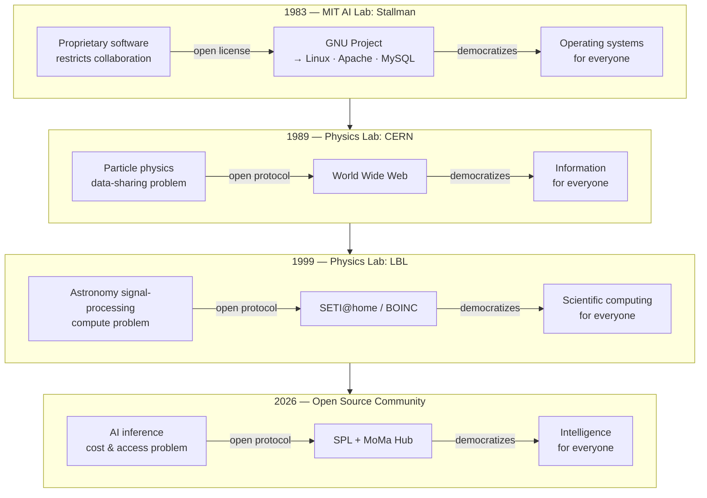
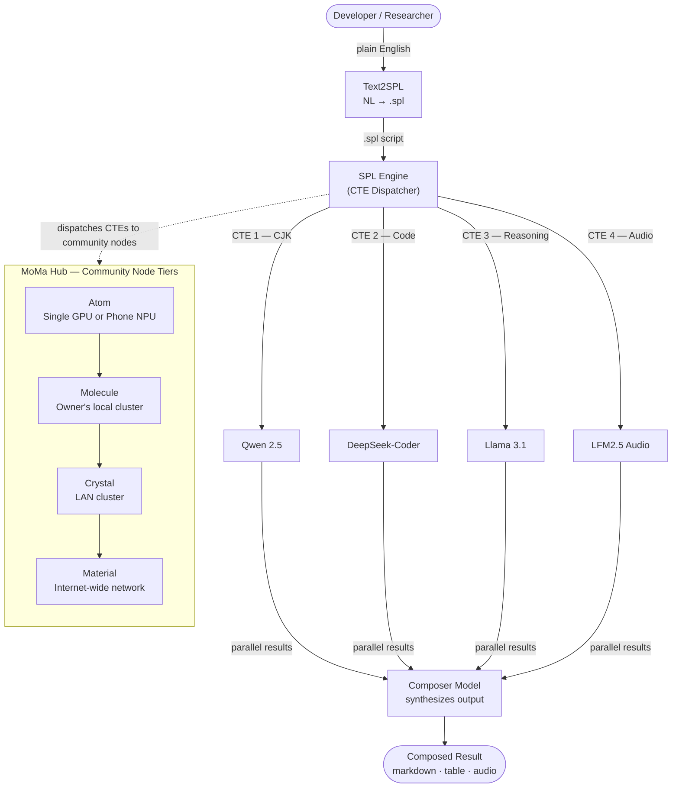

# The MoMa Moment: We Have a Choice

*by Wen G. Gong — March 2026*

---

> *MoMa: **M**ixture **o**f **M**odels on Ollam**a**.*
>
> *A distributed AI inference network where GPU owners
> contribute compute, earn rewards, and keep AI accessible —
> modelled after the economics of Uber and Airbnb,
> the technical architecture of SETI@home and BOINC,
> and the open-source ethos of GNU/Linux.*
>
> *We the people have a choice. We do not have to wait.*
>
---

## Physics Labs and the Infrastructure of Human Connection

There is a pattern in the history of technology that almost nobody talks about.

The most transformative public infrastructure of the modern era — the
infrastructure that democratized entire domains of human activity — did not
come from commercial incentive. It came from **physics labs**.

In 1989, Tim Berners-Lee was a software engineer at **CERN** — the European
particle physics laboratory in Geneva. The problem he was trying to solve was
mundane: physicists at CERN generated enormous amounts of data and struggled
to share it across institutions, computers, and continents. His proposal was
called "Information Management: A Proposal." His supervisor's response, written
in the margin: *"Vague but exciting."*

That vague, exciting proposal became the **World Wide Web**.

CERN did not set out to build the infrastructure of human knowledge. It set out
to study quarks. The Web was a side effect — an act of physics-lab
problem-solving that happened to change everything.

A decade later, in 1999, another physics lab did it again.

---

## A Memory from Berkeley, 1999

I was a physics post-doc at **Lawrence Berkeley National Laboratory** —
the same institution that discovered plutonium, built the first cyclotron,
and gave the world the standard model of particle physics — when SETI@home
launched in May 1999.

The idea was almost absurdly simple: the search for extraterrestrial intelligence
required an enormous amount of signal processing — more than any single university
computing cluster could handle. So Berkeley asked for help. Not people's money.
Not their expertise. Just their **idle CPU cycles**.

Five million people said yes.

Their screensavers flickered to life with visualizations of radio telescope data
being crunched in the background — while people slept, while they made coffee,
while they were in meetings. Over 21 years, those contributing computers collectively
processed data that no institution could have afforded to process alone.

In January 2026, the Berkeley team announced that this community-powered analysis
had winnowed **12 billion detections down to 100 candidate signals** — now being
followed up with China's FAST telescope, the most sensitive radio telescope ever built.

The contributors did real science. The model worked.

I was inside that lab when it launched. I watched it happen.

I have been thinking about that moment a lot lately. Because I believe something
structurally similar — but economically far more significant — is about to
happen to AI.

---

## The Pattern

CERN did not build the Web to make money. LBL did not build SETI@home to
disrupt the computing industry. In both cases, physicists faced a data problem
that no existing infrastructure could solve — and built something new.

The Web democratized **information**: knowledge that once lived in university
libraries and corporate archives became universally reachable, at near-zero
marginal cost, to anyone with a connection.

SETI@home democratized **scientific computing**: processing power that once
required institutional supercomputers became collectively achievable by
aggregating idle cycles from millions of participants.

But the pattern goes deeper than two examples. In 1983, Richard Stallman
gave up his position at the MIT AI Lab to launch the GNU Project — the
founding act of the open-source software movement. His manifesto, published
in 1985, made a case that software itself should be a commons: auditable,
improvable, and redistributable by anyone. He was not building a product.
He was building a principle.

I arrived in the United States in 1985 — the same year that manifesto
appeared. Reading Stallman's story planted something. I watched Linux follow
from it. Then Apache, MySQL, PostgreSQL. A generation of open-source
infrastructure emerged and became the silent foundation under almost
everything we use.

GNU/Linux democratized the **operating system**: the software layer that
once ran only on machines you licensed from IBM or Sun became collectively
buildable, ownable, and freely redistributable.

All three revolutions followed the same logic: the asset already existed
(knowledge, computing cycles, software), scattered and underutilized or
artificially restricted. The innovation was a **protocol** — a coordination
layer, or a legal framework, or a distributed network — that made the latent
value collectively accessible.

We are not starting from scratch. We are a molecule in a cluster that has
been building for forty years. MoMa Hub is the next layer in that
tradition — not the first act, but the logical continuation.



---

## The Problem Worth Solving

The AI industry is building the most expensive infrastructure in human history.

Frontier AI labs — OpenAI, Google DeepMind, Anthropic, Meta — are racing to
build ever-larger models that require ever-larger context windows, which require
ever-larger data centers, which require ever-larger energy budgets. Microsoft and
OpenAI announced a $500 billion data center investment. Governments are writing
energy policy around AI power consumption. The [MIT Sloan AI/Tech Summit](https://www.mitsloantechsummit.com/) I attended
in early 2026 had "Energy Bottleneck" as its central theme.

The result: AI capability is rationed by ability to pay. You bring your data
to their compute. You pay per token. You depend on their uptime, their pricing,
their terms of service.

This is a familiar story. But this time, the stakes are higher than market share.

---

## The Scenario We Must Not Wait For

In February 2026, Citrini Research published a thought exercise called
["The 2028 Global Intelligence Crisis"](https://www.citriniresearch.com/p/2028gic)
— a fictional macro memo written from June 2028, looking back at how everything
went wrong. It is not a prediction. It is a scenario. And it should keep you
up at night.

The thesis: AI works. It works so well that it triggers a negative feedback
loop with no natural brake. Companies adopt AI agents that are faster, cheaper,
and more reliable than white-collar workers. Margins expand. Stocks rally.
Corporate profits reach record highs. Every individual company's response is
rational.

The collective result is catastrophic.

The paper calls it the **human intelligence displacement spiral**. A $180,000
product manager becomes a $45,000 gig worker. Multiply that by millions.
Discretionary spending collapses. The consumer economy — 70% of GDP — withers.
Citrini's fictional memo coins the term **"Ghost GDP"**: output that shows up
in the national accounts but never circulates through the real economy, because
machines do not buy coffee, do not pay rent, and do not service mortgages.

The velocity of money flatlines. The $13 trillion residential mortgage market
is structurally impaired — not cyclically stressed, but fundamentally broken,
because the income assumptions underlying those mortgages no longer hold.
Unemployment reaches 10.2%. The S&P 500 drops 38% from its October 2026 highs.
Policy response lags economic reality. The government considers proposals. The
spiral accelerates.

*"Each company's individual response was rational. The collective result was
catastrophic. Every dollar saved on headcount flowed into AI capability that
made the next round of job cuts possible."*

This is a scenario, not a prediction. But consider: **every enabling condition
it describes already exists in 2026.** The agentic coding tools, the SaaS
displacement, the procurement renegotiations, the white-collar layoffs — all
of this is happening right now, in early 2026, as you read this.

We do not have to wait until 2028 to discover whether this scenario unfolds.

We have a choice.

---

## The People Who Built Nvidia

Here is another thread that connects.

Nvidia is today the most valuable company on Earth, worth over $3 trillion.
How did it get here? Not through data centers. Through **gamers**.

For twenty-five years, the PC gaming community was Nvidia's core customer.
Millions of people bought GeForce cards generation after generation — not
because they were investors, but because they wanted better frame rates in
Counter-Strike, better ray tracing in Cyberpunk, better performance in their
hobby. That sustained demand funded Nvidia's R&D. It funded CUDA. It funded
the tensor cores that turned out to be perfect for deep learning. The AI
revolution was built on top of a graphics card business that gamers paid for.

Now Nvidia is pivoting.

Data center GPUs — H100, B200, GB200 — carry margins north of 70%. Consumer
GeForce cards carry margins of 30-40%. The arithmetic is simple. When a
hyperscaler will pay $30,000 for an H100, the incentive to allocate silicon
to a $500 RTX card diminishes.

I visited a Best Buy last weekend. The gaming GPU shelves told the story.
Supply is thinning. Prices are climbing. The community that built Nvidia is
watching its supply get redirected to serve the same data centers that are
centralizing AI capability — and, if the Citrini scenario is right,
displacing the jobs of the very people who bought those GeForce cards.

But here is the thing those data center strategists are not thinking about:

There are an estimated **50–100 million consumer GPUs** in gaming PCs and
workstations worldwide right now. RTX 4070s, 4080s, 4090s, GTX 1080 Tis,
M2 and M3 MacBooks. They are already purchased. They are already powered on.
They are already drawing electricity whether their owners use them or not.

And every one of them can run Ollama.

Every one of them can run a 7B parameter model at practical throughput.
Many can run 70B. They are sitting in bedrooms and home offices around the
world, idle 20 hours a day.

The people who built Nvidia's business already own the hardware. What they
lack is a coordination layer that lets them **put that hardware to work —
and earn from it.**

---

## We Have a Choice

Let me say this plainly, because it is the core of everything that follows.

The Citrini scenario describes a world where AI compute concentrates in data
centers, the productivity gains flow to capital owners, the consumer economy
collapses under the weight of its own displacement, and ordinary people have
no role except to be replaced.

**That is not the only path.**

There is another path — one where the compute is distributed, where GPU
owners are participants rather than casualties, where the value created by
AI inference flows to millions of households rather than a handful of data
center operators.

The infrastructure for that path already exists:

1. **Open-weight models** — Llama, Qwen, Mistral, DeepSeek *(already here)*
2. **A local inference runtime** — Ollama *(already here)*
3. **50–100 million consumer GPUs** — in gaming PCs worldwide *(already purchased)*
4. **A declarative orchestration layer** — SPL *(available now, open-source)*
5. **A coordination and reward platform** — MoMa Hub *(building now)*

We do not need permission from Nvidia, or OpenAI, or any frontier lab. We
do not need to wait for government policy. We do not need new hardware. We
need a protocol that connects what already exists.

This is MoMa.

And if you are a PC gamer with a GPU gathering dust between sessions — you
are not a bystander in the AI economy. You are a potential node in it.

---

## History May Not Repeat, But Rhymes

Every generation, a dominant technology platform creates dependency.
Every generation, an open architecture breaks the cycle.

| Era | The Centralised Platform | The Break-away |
|-----|--------------------------|----------------|
| 1970s–1980s | IBM Mainframe: proprietary hardware + OS, you lease the machine | Minicomputers (DEC), then the personal computer |
| 1983–present | Proprietary software: no source, no sharing, no modification | **GNU Project → Linux · Apache · MySQL** (Stallman's gift) |
| 1990s–2000s | Oracle DB: proprietary SQL dialects, migration costs a decade | MySQL, PostgreSQL + Hadoop, Spark |
| 2000s–2010s | On-premises data centres: CapEx hardware, vendor contracts | Cloud computing: rent elastically, own nothing |
| 2020s–present | Frontier AI Labs: API-only, per-token billing, context window arms race | Open-weight models + **Ollama** + **SPL** + **MoMa Hub** |

The break-away pattern is always the same. An open alternative reaches
*good enough* quality at a fraction of the cost. A declarative abstraction layer
— SQL, Hadoop YARN, Kubernetes, now SPL — hides the underlying provider and
makes switching cost near zero.

IBM did not lose to a better mainframe. It lost to a different paradigm: the PC.
Oracle did not lose to a better proprietary database. It lost to open-source
correctness (PostgreSQL) and a new architectural model (Hadoop).

The question is: what sidesteps the frontier-lab API model?

I think the answer is **MoMa**.

---

## What Is MoMa?

MoMa — **Mixture of Models on Ollama** — is four things braided together:

**MoM — Mixture of Models.**
Rather than sending every query to one giant generalist model, you route each
task to the specialist model best suited for it. CJK language tasks go to
Qwen. Code goes to DeepSeek-Coder. Mathematics goes to DeepSeek-R1.
Multi-step reasoning goes to a Claude or Llama reasoning model. A single
declarative script orchestrates all of them, each playing its part like
instruments in an orchestra — an *AI Symphony*.

*(The metaphor is not accidental. Listening to Beethoven's nine symphonies —
each movement with its own distinct character, yet cohering into a unified
whole — is what first planted the image. Each model plays to its strength,
coordinated not by a conductor waving a baton but by the declarative structure
of the `.spl` script itself.)*

**Ollama — Local-first LLM inference.**
Ollama is an open-source runtime that lets you run any of dozens of
open-weight models — Llama 3.1, Qwen 2.5, Mistral, DeepSeek — on your own
hardware. A laptop. A workstation. A gaming PC. No API key. No data leaves your
machine. No per-token billing. The marginal cost of one inference is the
electricity your GPU was already drawing.

**SPL — Structured Prompt Language.**
SPL is the declarative orchestration layer that makes MoM + Ollama compose into
something powerful. It is a SQL-inspired query language for LLM interactions
(arXiv:2602.21257) that lets you write a single `.spl` script to coordinate
multiple specialist models, manage token budgets, split long documents into
parallel chunks, and route the whole pipeline — locally, in the cloud, or across
a hybrid of both — without changing a line of code.

**MoMa Hub — The distributed inference platform.**
The missing piece that turns individual Ollama nodes into a collective
infrastructure. Modelled after Docker Hub (share configurable runtimes) and
GitHub (share software). MoMa Hub is where anyone can register a distributed
inference node — contributing their hardware, earning rewards proportional to
the compute they provide, and making AI inference accessible to people who
could never afford frontier API pricing. The target hardware is deliberately
modest: a **GeForce GTX 1080 Ti** — a 2017-era card with 11 GB VRAM, available
second-hand for under \$150 — can run a 7B parameter specialist model at
practical throughput.

MoMa is the union of all four: *declarative multi-model orchestration,
running locally on hardware you already own, contributed and rewarded
through an open hub.*



---

## The SETI@home Parallel — And Why MoMa Goes Further

Here is the part that excites me most — and that took me back to Berkeley 1999.

Today, one developer running SPL + Ollama on their own GPU can handle complex
multi-model AI workflows overnight at zero marginal cost. That is already
remarkable.

But consider what comes next.

SETI@home did not ask people to buy new hardware. It asked them to share
**idle cycles on hardware they already owned**. The compute was already there,
sitting unused. BOINC — the open infrastructure Berkeley built — was the
coordination layer that turned millions of idle machines into a coherent
scientific instrument.

Now look around you. There are an estimated **50–100 million consumer GPUs**
in gaming PCs and workstations worldwide — RTX 4070s, 4080s, 4090s, M2 and
M3 MacBooks — sitting largely idle while their owners sleep.

Every one of them can run Ollama.

What is missing is the BOINC-equivalent: a coordination layer that can break
a complex query into chunks, dispatch each chunk to a contributing Ollama node,
collect the results, and synthesize a final answer. SPL's CTE architecture —
where each *Common Table Expression* is an independently executable work unit
— is already structured exactly this way.

This is the **MoMa moment**: the distributed community computing model,
applied to AI inference.

But MoMa goes further than SETI@home in one critical respect.

SETI@home asked for altruism. The five million participants received no
compensation — they contributed because the cause felt worthy. That was
remarkable and beautiful, and it worked for science.

**It will not work for economic resilience.**

If the Citrini scenario is even directionally correct — if AI displacement is
going to compress incomes and hollow out the consumer economy — then we need
more than altruism. We need a model where contributing compute **generates
income**. Where GPU owners are economic participants, not benefactors. Where
the value created by distributed inference flows back to the people providing
the hardware, the electricity, and the availability.

SETI@home proved that distributed computing works at scale.
MoMa is the next step: proving that distributed computing can create
**distributed prosperity**.

---

## The Technical Foundation

The reason this is architecturally viable — not just a romantic idea — lies in
a simple piece of mathematics.

The attention mechanism in transformer models scales as **O(N²)** with sequence
length N. Sending a 100,000-token document to a single model costs O(N²) in
attention compute. But if you split that document into k chunks of N/k tokens
each, and process them in parallel, the total cost is:

```
O(k × (N/k)²) = O(N²/k)
```

That is a **linear reduction** with the number of chunks. Eight chunks: 8× less
attention compute. Sixteen chunks: 16× less. The math does not care whether
the chunks run on one machine or a thousand.

SPL's Logical Chunking feature formalizes this pattern declaratively. Here is a
simplified example — a research paper analyzed by splitting it into sections,
each processed independently, then synthesized:

```sql
PROMPT analyze_research_paper
WITH BUDGET 32000 tokens
USING MODEL auto    -- each CTE routed to its specialist

WITH chunk_intro AS (
    SELECT context.section_intro AS text LIMIT 3000 tokens
    GENERATE section_summary(text)
    WITH OUTPUT BUDGET 600 tokens
),
chunk_method AS (
    SELECT context.section_method AS text LIMIT 3000 tokens
    GENERATE section_summary(text)
    WITH OUTPUT BUDGET 600 tokens
),
chunk_results AS (
    SELECT context.section_results AS text LIMIT 3000 tokens
    GENERATE section_summary(text)
    WITH OUTPUT BUDGET 600 tokens
)

SELECT
    system_role("You are a thorough research analyst"),
    chunk_intro    AS intro_summary,
    chunk_method   AS method_summary,
    chunk_results  AS results_summary
GENERATE comprehensive_review(intro_summary, method_summary, results_summary)
WITH OUTPUT BUDGET 2000 tokens, FORMAT markdown;
```

The same `.spl` script runs in two modes **without modification**:

- **Parallel (cloud):** CTEs dispatched concurrently via `asyncio.gather`.
  Results in seconds.
- **Sequential (local):** CTEs executed one at a time on a local Ollama instance.
  The same result produced overnight at zero marginal cost.

This is SQL's foundational abstraction applied to AI: the same `SELECT` query
runs on a laptop SQLite database or a distributed cluster. The logical intent
is unchanged; only the physical execution engine differs.

Now extend "local Ollama" to "distributed Ollama community nodes" and you have
SETI@home for AI inference — except this time, the nodes earn.

---

## The MoMa Hub: Docker Hub + GitHub for Distributed AI

SETI@home needed BOINC before idle CPUs could become a coherent instrument.
The same is true here. The local pieces (Ollama, open-weight models, SPL) are ready.
The missing layer is a platform that lets people *contribute*, *discover*, and
*earn from* inference capacity the way they already contribute and discover software.

| Platform | What you contribute | What you get |
|----------|--------------------|----|
| **Docker Hub** | A container image — a reproducible runtime | Anyone can `docker pull` your environment |
| **GitHub** | Code, scripts, configurations | Anyone can `git clone` and build on your work |
| **Uber** | Your car and your time | Rides matched to passengers; you earn per trip |
| **Airbnb** | Your spare room | Guests matched to hosts; you earn per night |
| **MoMa Hub** | **Your GPU, your models, your availability** | **Tasks matched to nodes; you earn per inference** |

**Runtime contribution (Docker Hub model).**
A contributor publishes an Ollama profile: which models they have pulled,
what GPU they are running, what throughput they can sustain, what hours
they are typically online. Think of it as a `Dockerfile` for an AI inference
node: reproducible, versioned, shareable.

**Software contribution (GitHub model).**
A contributor publishes SPL scripts, model routing configurations, and
orchestration recipes — reusable `.spl` files that others can fork and run
on the network. A researcher who has perfected a Map-Reduce chunking script
for legal documents publishes it; a startup in Nairobi forks it for
local-language contracts without writing a line of orchestration code.

**Economic participation (Uber/Airbnb model).**
A contributor registers their GPU node and earns MoMa credits for every
inference task processed. A GTX 1080 Ti running overnight can process
thousands of tasks. The rewards are proportional to the compute provided —
more tokens processed, more credits earned. The GPU that was drawing standby
power anyway is now generating value.

The target hardware is deliberately unglamorous. A **GeForce GTX 1080 Ti**
(2017, 11 GB VRAM) runs Llama 3.2 3B at ~30 tokens/second and Qwen 2.5 7B
at ~15 tokens/second — entirely adequate for most summarisation, translation,
and analysis tasks. These cards sell for \$100–150 on eBay. They exist in tens
of millions of gaming PCs, drawing standby power every night whether their
owners use them or not.

MoMa Hub does not ask anyone to buy new hardware. It offers owners of *already
purchased, already powered, already idle* GPUs a way to **participate
economically in the AI revolution** — rather than be sidelined by it.

---

## MoMa Rewards: A Micro-Economy for Distributed Compute

This is where MoMa becomes more than a technical project. It becomes a
**mini-economic experiment**.

The Citrini scenario describes a world where AI-generated productivity accrues
to capital owners and never circulates through the consumer economy — "Ghost GDP."
MoMa Rewards is designed to test a counter-model: what happens when AI compute
value flows to millions of distributed GPU owners instead of a handful of data
center operators?

**How it works:**

Every time a MoMa node processes an inference task — a chunk of text summarized,
a translation completed, a code snippet analyzed — the hub records the work in
an append-only reward ledger:

| What is tracked | How |
|----------------|-----|
| Agent ID | Which GPU node did the work |
| Task ID | Which inference task was completed |
| Tokens processed | Input + output tokens (measured, not estimated) |
| Credits earned | 1 credit per 1,000 tokens (adjustable) |
| Timestamp | When the work was recorded |

The ledger is append-only — no updates, no deletions. Every credit is traceable
to a specific task, a specific node, a specific moment. This is the accounting
integrity of a blockchain without the energy waste of proof-of-work, because the
"proof" is the useful inference itself.

**What credits represent:**

In the initial PoC, MoMa credits are a reputation and accounting mechanism —
a transparent record of who contributed what. As the network grows, credits
become the basis for reciprocity: you earn credits by contributing compute,
and you spend credits by consuming compute from other nodes. Contribute
overnight while you sleep; use the network's collective power during the day
for your own work.

**The economic hypothesis:**

The Citrini scenario's core mechanism is concentration: AI productivity flows
to data center owners, bypasses workers, and starves the consumer economy.
MoMa Rewards tests the inverse: **what if AI productivity flows to distributed
GPU owners — ordinary people in ordinary households?**

A single GTX 1080 Ti running overnight (8 hours, ~150W, ~$0.15 in electricity)
can process 30,000–100,000 tokens. At the reward rate of 1 credit per 1,000
tokens, that is 30–100 credits per night. Scale that to a thousand nodes and
you have a micro-economy where compute value circulates to real people, in real
households, paying real electricity bills.

This is not a solution to the 2028 crisis. It is an **experiment** — a proof
of concept that distributed AI compute can create distributed economic
participation. If it works at the scale of a LAN test with three GTX 1080 Tis,
it can be studied. If it works at the scale of a thousand nodes, it can be a
model. If it works at the scale of a million nodes, it changes the arithmetic
of the Citrini scenario entirely.

We do not know yet. That is why we are building it.

---

## The Energy Argument

An RTX 4090 running Llama 3.1 8B uses roughly **150W under load**. An overnight
run (8 hours) consumes 1.2 kWh — about **$0.15** at average US electricity prices.
In that time it can process approximately 30,000–100,000 tokens of inference.

The equivalent via a frontier API:

| Provider | Price per 1K tokens | Cost for 100K tokens |
|----------|---------------------|----------------------|
| GPT-4o | ~$0.01–0.03 | $1,000–$3,000 |
| Claude Sonnet | ~$0.003–0.015 | $300–$1,500 |
| OpenRouter (budget models) | ~$0.001 | ~$100 |
| **RTX 4090 + Ollama** | **~$0.0015** | **~$0.15** |

The consumer GPU is **600× to 6,000× cheaper** for equivalent inference volume.

The MoMa model does not build new data centres. It uses the compute that
already exists, that is already paid for, that is already consuming standby
power whether you use it or not. And with MoMa Rewards, the electricity cost
is not a donation — it is an investment that earns back in credits.

---

## The Economics of the Context Window

There is an economic logic to the frontier AI arms race that is worth
understanding clearly — not as a criticism, but as a map of the terrain.

A million-token context window means you send a million tokens to their API.
At $0.01 per thousand tokens, that is $10 per query. At a billion queries per
day — the scale they are targeting — that is $10 billion per day of potential
API revenue.

This is structurally identical to what IBM and Oracle built in their respective
eras. IBM charged per compute hour, priced to be indispensable — not to give
you the best computer, but to make the question *"should I stay on IBM?"*
too expensive to ask. Oracle's proprietary PL/SQL, optimizer hints, and migration
friction were not accidents. They were the product.

The PC did not beat the mainframe by being a better mainframe.
Hadoop did not beat Oracle by being a better Oracle.
MoMa will not beat the frontier API model by being a cheaper API.

It will beat it by making the question *"which API do I use?"* irrelevant.

When your `.spl` script runs identically on a local Ollama instance and on
OpenRouter cloud, the provider becomes a runtime detail — swappable without
changing a line of logic. You do not migrate away from a frontier lab. You
simply stop needing them for the tasks where open-weight models are good enough
— which is most tasks, today, and nearly all tasks within three years.

---

## The Sharing Economy Parallel

I told a friend about all of this. She is not a software engineer. She is a
frequent traveler.

She got it immediately.

"That's the Airbnb model," she said. "Airbnb didn't build hotels. They found
spare rooms that already existed and connected them to people who needed them.
And the hosts *earn money*."

Then, a beat later: "And Uber didn't build cars. They found drivers who
already had one. The drivers *earn money*."

That is the idea in two sentences. The sharing economy did not create new assets.
It created **coordination layers** that made existing idle assets productive —
and compensated the people who owned them.

| Platform | Under-utilized asset | Coordination layer | Owner earns |
|----------|---------------------|--------------------| ------------|
| **Airbnb** | Spare rooms in homes | Marketplace + booking | Per night |
| **Uber / Lyft** | Spare cars + driver time | Ride-matching + routing | Per ride |
| **Docker Hub** | Reproducible runtimes | Container registry | — |
| **GitHub** | Software + configs | Git + pull requests | — |
| **MoMa Hub** | **Idle GPUs (1080 Ti, 4070…)** | **SPL + Ollama + MoMa Hub** | **Per inference** |

SETI@home proved that millions of people will contribute idle compute for a
cause they believe in. Uber and Airbnb proved that millions more will do so
when they also **earn from the contribution**. MoMa combines both motivations:
a cause worth supporting *and* an economic return on hardware you already own.

---

## The Democratic AI Manifesto

I want to say this plainly.

AI capability should not be rationed by ability to pay API credits. Not by
geography. Not by institutional affiliation. And the productivity gains
from AI should not flow exclusively to the owners of data centers.

A physics student in Lagos with a mid-range gaming PC and an internet connection
should be able to run the same multi-model AI workflows as a researcher at MIT
with a cloud budget. A small business in rural Iowa should be able to analyze
its documents with specialist AI models without sending its data to a server
farm in Virginia. And a gamer in Seoul with a GPU that is idle 20 hours a day
should be able to earn from making that compute available to the network.

This is not a utopian fantasy. It is a description of what Ollama + open-weight
models already make possible for a single user, today. MoMa extends that to
collaborative, distributed inference — and adds the economic layer that SETI@home
never had.

The Internet democratized **information**. MoMa Hub aims to democratize
**intelligence** — the capacity to think with AI, at scale, without asking
permission or paying a toll — while ensuring that the people who provide the
compute share in the value it creates.

We the people have a choice. We can watch the Citrini scenario unfold from
the sidelines, or we can start building the alternative now — with hardware
we already own, models that are already open, and a protocol we can design
together.

We choose to build.

---

## A Call to the Community

If the history of SETI@home, Uber, and Airbnb teaches us anything, it is that
people will put their idle assets to productive use — especially when the cause
is worth it, and especially when they earn from the participation.

The MoMa ask:

> Your GPU is mostly idle — even a GTX 1080 Ti from 2017 will do.
> Open-weight models are good enough for most tasks.
> Ollama makes it trivial to run them.
> Register your node on MoMa Hub. Earn MoMa credits for the compute you
> provide. Help us prove that distributed AI inference works at scale —
> that no single lab needs to own it — and that the economic value of AI
> can flow to the people, not just the platforms.

There are two open engineering problems to solve: the **MoMa Hub** coordination
platform (hub-and-spoke dispatch, reward ledger, node discovery) and
the **work-unit protocol** — the BOINC-equivalent that breaks SPL queries into
CTE work units, dispatches them to community nodes, and synthesizes the result.

The MoMa moment is now.

---

## Where to Start

If you want to run SPL today — on your own machine, with Ollama, at zero cost:

```bash
pip install spl-llm      # SPL engine
pip install spl-flow     # Agentic orchestration layer

ollama pull llama3.1     # One-time model download (~4GB)

spl init
spl execute examples/hello_world.spl
```

If you want to join the MoMa Hub network:

```bash
pip install momahub      # MoMa Hub agent

moma join http://hub.example.com:8000 --pull   # Register your GPU, start earning
moma status              # Check your node, see credits earned
moma rewards             # View your reward ledger
```

The repositories are open, the documentation is live, and contributions are
very welcome. If you are interested in the hub architecture, the reward
protocol, or the distributed dispatch system — open an issue or reach out
directly.

---

## References

[1] Wen G. Gong, *Structured Prompt Language: Declarative Context Management
for LLMs*, arXiv:2602.21257 [cs.CL, cs.PL, cs.DB] (2026).
https://arxiv.org/abs/2602.21257

[2] Citrini Research and Alap Shah, *The 2028 Global Intelligence Crisis:
A Thought Exercise in Financial History, from the Future* (February 2026).
https://www.citriniresearch.com/p/2028gic

**Open-source packages (Apache 2.0):**
- `pip install spl-llm` — SPL engine: https://github.com/digital-duck/SPL
- `pip install spl-flow` — Agentic orchestration: https://github.com/digital-duck/SPL-flow
- `pip install momahub` — Distributed inference hub: https://github.com/digital-duck/momahub

**Mentioned tools and projects:**
- [Ollama](https://ollama.ai) — local LLM inference runtime
- [OpenRouter](https://openrouter.ai) — unified API for 100+ cloud models
- [SETI@home](https://setiathome.berkeley.edu) — UC Berkeley distributed computing
- [BOINC](https://boinc.berkeley.edu) — Berkeley Open Infrastructure for Network Computing
- [World Wide Web proposal](https://info.cern.ch/hypertext/WWW/Proposal.html) — Tim Berners-Lee, CERN, 1989

---

*Wen G. Gong is a former physics post-doc at Lawrence Berkeley National
Laboratory (LBNL) and a data/AI engineer with 20+ years of experience across
SQL, Oracle, and enterprise data systems. He is the author of SPL (Structured
Prompt Language) and SPL-Flow. He can be reached at wen.gong.research@gmail.com.*

---

---

> *We are not building an alternative to frontier AI labs —
> we are building the resilience layer that makes AI infrastructure
> as distributed as the Internet, as open as Linux,
> and as economically inclusive as the sharing economy.*

*© 2026 Wen G. Gong. Licensed under CC BY 4.0. Share freely with attribution.*

---

*Suggested Medium tags: Artificial Intelligence · Open Source · Distributed Systems ·
Machine Learning · Technology · Economics · GPU Computing · LLM*
