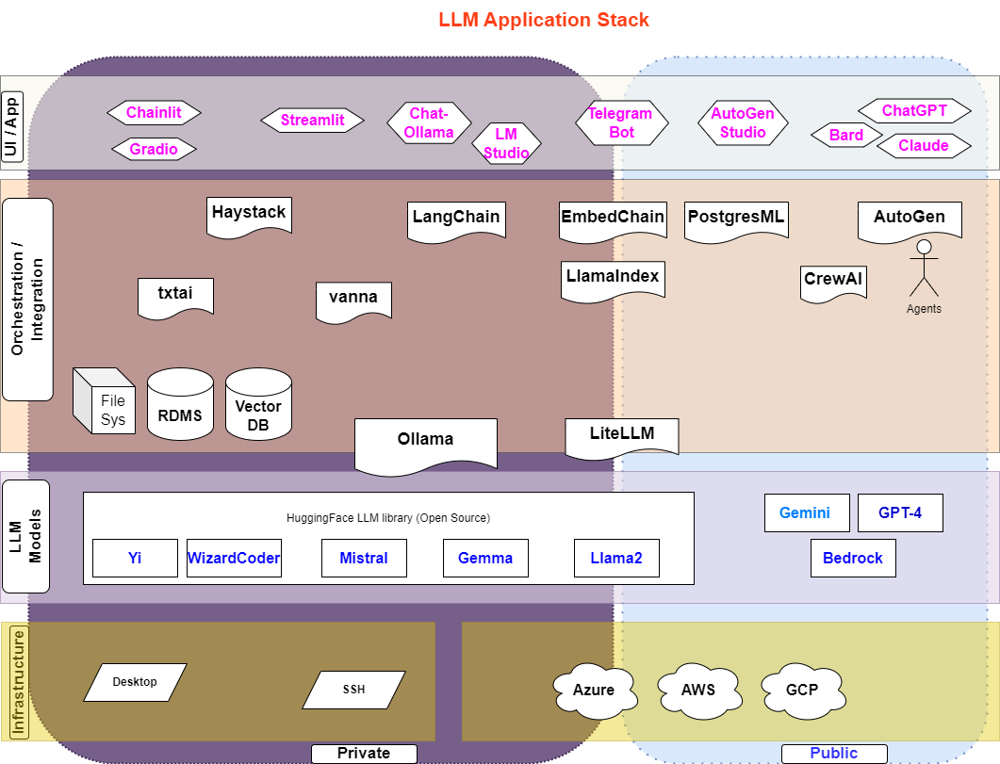
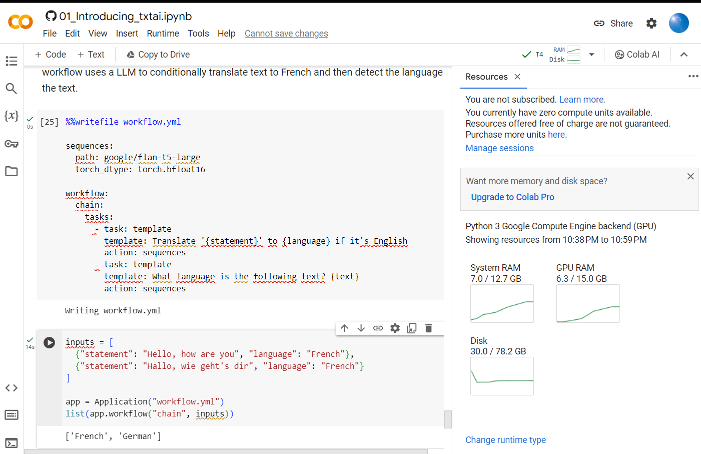

# [LLM](https://www.wikiwand.com/en/Large_language_model) App Framework

## Architecture Diagram


(created in DrawIO)


## Frontend : Human-Machine-Interface

### [Chainlit](https://docs.chainlit.io/get-started/overview)

Build Python LLM apps in minutes 
- Github: https://github.com/Chainlit/chainlit 
- Demo: https://github.com/AI-Maker-Space/Introduction-to-Chainlit

### [Streamlit](https://streamlit.io/)
A faster way to build and share data apps

### [Gradio](https://github.com/gradio-app/gradio)

Build and share delightful machine learning apps, all in Python.

### [Ollama-WebUI](https://github.com/ollama-webui/ollama-webui)
ChatGPT-Style Web UI Client for Ollama
- [Docs](https://ollamahub.com/)


### [RasaGPT](https://github.com/paulpierre/RasaGPT)
RasaGPT is the first headless LLM chatbot platform built on top of Rasa and Langchain. Built w/ Rasa, FastAPI, Langchain, LlamaIndex, SQLModel, pgvector, ngrok, telegram
- [Docs](https://rasagpt.dev/)

### [ChatBot Ollama](https://github.com/ivanfioravanti/chatbot-ollama)

Chatbot Ollama is an open source chat UI for Ollama.

### [AutoGen Studio](https://github.com/microsoft/autogen/tree/main/samples/apps/autogen-studio)
an AutoGen-powered AI app (user interface) to help you rapidly prototype AI agents, enhance them with skills, compose them into workflows and interact with them to accomplish tasks. It is built on top of the AutoGen framework, which is a toolkit for building AI agents

### [LM Studio](https://lmstudio.ai/)
Discover, download, and run local LLMs

## Mid-Tier : workflow orchestration and service integration

### [AutoGen](https://github.com/microsoft/autogen)

Enable Next-Gen Large Language Model Applications (see also AutoGen studio)

### [CrewAI](https://github.com/joaomdmoura/crewAI)
Framework for orchestrating role-playing, autonomous AI agents. By fostering collaborative intelligence, CrewAI empowers agents to work together seamlessly, tackling complex tasks.

- Setup
```
conda activate autogen
pip install crewai
pip install duckduckgo-search
```

### [LangChain](https://github.com/langchain-ai/langchain)

Building applications with LLMs through composability

### [PostgresML](https://github.com/postgresml/postgresml)
The GPU-powered AI application database. Get your app to market faster using the simplicity of SQL and the latest NLP, ML + LLM models.
- [Homepage](https://postgresml.org/)


### [Haystack](https://github.com/deepset-ai/haystack)

LLM orchestration framework to build customizable, production-ready LLM applications. Connect components (models, vector DBs, file converters) to pipelines or agents that can interact with your data. With advanced retrieval methods, it's best suited for building RAG, question answering, semantic search or conversational agent chatbots.

- [Tutorials](https://github.com/deepset-ai/haystack-tutorials)
- [Demos](https://github.com/deepset-ai/haystack-demos)


#### Building a private GPT with Haystack

- [Part-1: Why+How](https://medium.com/@fvanlitsenburg/building-a-privategpt-with-haystack-part-1-why-and-how-de6fa43e18b)
- [Part-2: Code](https://medium.com/@fvanlitsenburg/building-a-private-gpt-with-haystack-part-2-code-in-detail-7e0dfb9eb3ad)
- [Part-3: use Llama](https://medium.com/@fvanlitsenburg/building-a-private-gpt-with-haystack-part-3-using-llama-2-with-ggml-c2d994da40da)
- [Promptbox](https://github.com/fvanlitsenburg/promptbox)
- [Author-Felix Van Litsenburg](https://medium.com/@fvanlitsenburg)


### [PrivateGPT](https://github.com/imartinez/privateGPT)

Interact with your documents using the power of GPT, 100% privately, no data leaks

-   Docs: https://docs.privategpt.dev/

### [LlamaIndex](https://github.com/run-llama/llama_index)

LlamaIndex (formerly GPT Index) is a data framework for your LLM applications

- Docs: https://docs.llamaindex.ai/
- Examples: https://github.com/run-llama/llama_index/tree/main/docs/examples

### [embedchain](https://github.com/embedchain/embedchain)
- Docs: https://docs.embedchain.ai/


## DB Stores

- [Top 5 Vector DB](https://www.datacamp.com/blog/the-top-5-vector-databases)
- [Vector DB comparisons](https://www.youtube.com/watch?v=zGAkhN1YZXM) by [Kamalraj](https://github.com/Kamalabot)


### [PGVector](https://github.com/pgvector/pgvector)
Open-source vector similarity search for Postgres

### [FAISS](https://github.com/facebookresearch/faiss)
A library for efficient similarity search and clustering of dense vectors.
- [Docs](https://faiss.ai/)

### [Qdrant](https://github.com/qdrant/qdrant)
High-performance, massive-scale Vector Database for the next generation of AI (implemented in Rust). Also available in the cloud https://cloud.qdrant.io/ 
```
pip install qdrant-client
```

### [Vilvus](https://milvus.io/)

### [Pinecone](https://docs.pinecone.io/docs/quickstart)

### [SQLite-VSS](https://github.com/asg017/sqlite-vss)
A SQLite extension for efficient vector search, based on Faiss

-   sqlite-vss GitHub repository: https://github.com/asg017/sqlite-vss
-   Introducing sqlite-vss: A SQLite Extension for Vector Search: https://observablehq.com/@asg017/introducing-sqlite-vss
-   SQLite-VSS - ️ Langchain: https://api.python.langchain.com/en/latest/vectorstores/langchain.vectorstores.sqlitevss.SQLit

### [MindsDB](https://github.com/mindsdb/mindsdb)
MindsDB connects AI models to real time data

## Backend : interface to various LLM models and resources

### [Ollama](https://ollama.ai/)

Get up and running with Llama 2 and other large language models locally

### [LiteLLM](https://github.com/BerriAI/litellm)

Call all LLM APIs using the OpenAI format. Use AWS Bedrock, Azure, OpenAI, Cohere, Anthropic, Ollama, Sagemaker, HuggingFace, Replicate (100+ LLMs)

### [vLLM](https://github.com/gongwork/vllm)
A high-throughput and memory-efficient inference and serving engine for LLMs

# Solutions: AI Apps & Use-Cases

## [open-interpreter](https://github.com/KillianLucas/open-interpreter)
A natural language interface for computers, uses `LiteLLM` to connect to hosted LLM


## [llmware](https://github.com/llmware-ai/llmware)

Providing enterprise-grade LLM-based development framework, tools, and fine-tuned models.

## RAG
Neural Search: semantic search, key word search, recommender

-   [RAG Concept](https://docs.llamaindex.ai/en/stable/getting_started/concepts.html)
-   [10 Ways to Improve RAG](https://towardsdatascience.com/10-ways-to-improve-the-performance-of-retrieval-augmented-generation-systems-5fa2cee7cd5c)
-   [Claude RAG Demo](https://github.com/anthropics/anthropic-retrieval-demo#setting-up-and-using-an-embedding-database)
-   [llamaIndex RAG](https://github.com/run-llama/rags)
-   [llama-coder](https://github.com/ex3ndr/llama-coder)
-   Smart RAG: Domain-specific fine-tuning for end-to-end Retrieval
    -   [Speaker - Greg Loughnane](https://www.linkedin.com/in/gregloughnane/)
    -   [Video](https://www.youtube.com/watch?v=0QaUqoICNBo&t=272s)
    -   [Slide](https://www.canva.com/design/DAFvFEhCJtg/Mthlo-nWXAPck3iK3JaB7Q/edit)
    -   [Code](https://github.com/arcee-ai/DALM/tree/main%20(Domain%20Adapted%20Lang%20Modeling%20Toolkit))
    -   [Company - AI Maker Space](https://github.com/AI-Maker-Space/Fine-tuning-LLM-Resources)
    -   [Paper - Improving the Domain Adaptation of Retrieval Augmented Generation (RAG) Models for Open Domain Question Answering](https://arxiv.org/pdf/2210.02627.pdf)
    -   [LlmOps](https://github.com/AI-Maker-Space/Interactive-Dev-Environment-for-LLM-Development)

- [LlamaIndex Workshop: Multimodal + Advanced RAG Workhop with Gemini](https://www.youtube.com/watch?v=fdpaHJlN0PQ)
    - https://github.com/run-llama/llama_index/tree/main/docs/examples/multi_modal/gemini.ipynb

## Neural-Search

### [txtai](https://medium.com/neuml/introducing-txtai-the-all-in-one-embeddings-database-c721f4ff91ad) 
All-in-one open-source embeddings database for semantic search, LLM orchestration and language model workflows
- [GitHub](https://github.com/neuml/txtai) 
- [Docs](https://neuml.github.io/txtai/)

- Run [Example Notebooks](https://neuml.github.io/txtai/examples/) in Google Colab

## AI Assistant

### [big-AGI](https://github.com/enricoros/big-AGI)

Personal AI application powered by GPT-4 and beyond, with AI personas, AGI functions, text-to-image, voice, response streaming, code highlighting and execution, PDF import, presets for developers, much more. Deploy and gift #big-AGI-energy! Using Next.js, React, Joy.

#### [big-AGI/Ollama](https://github.com/enricoros/big-agi/blob/main/docs/config-ollama.md)

This guide helps you connect Ollama models to big-AGI for a professional AI/AGI operation and a good UI/Conversational experience. The integration brings the popular big-AGI features to Ollama, including: voice chats, editing tools, models switching, personas, and more.

### [Cheshire-Cat](https://github.com/cheshire-cat-ai/core)

Production ready AI assistant framework

### [Amica](https://github.com/semperai/amica)

Amica is an open source interface for interactive communication with 3D characters with voice synthesis and speech recognition.

### Other use-cases
- arXiv research assistant
- Tutors help student learn
- Personal assistants help senior living
- MyLib as personal resource

## Local AI-App Development

### [Ollama](https://ollama.ai/)

Get up and running with Llama 2 and other large language models locally

### [Bionic-GPT](https://github.com/bionic-gpt/bionic-gpt)

BionicGPT is an on-premise replacement for ChatGPT, offering the advantages of Generative AI while maintaining strict data confidentiality

### [chatd](https://github.com/BruceMacD/chatd)

Chat with your documents using local AI

# Development Resources

## IDE
### VS [Code](https://code.visualstudio.com/)

Code editing - Redefined

### Google [Colab](https://colab.google/)
Colab is a hosted Jupyter Notebook service that requires no setup to use and provides free access to computing resources, including GPUs and TPUs. Colab is especially well suited to machine learning, data science, and education.


## Productivity Tools

### [DrawIO](https://www.drawio.com/)
has both cloud and desktop versions.

### Google Drive

# Learning Resources

## YouTube channels

| Title                      | URL                                                                                 | GitHub                                        | local                                         | Note |
|---------------|---------------|---------------|---------------|---------------|
| --- | --- | --- | --- | --- |
|The future of Gen AI (Turing Lecture)| https://www.youtube.com/watch?v=2kSl0xkq2lM | --------------- | --------------- | Michael Wooldridge: Director of Foundational AI Research|
| LangChain by Sam Witteveen | https://www.youtube.com/watch?v=3yPBVii7Ct0&list=PL8motc6AQftn-X1HkaGG9KjmKtWImCKJS | https://github.com/samwit/langchain-tutorials | projects\ai\sam\_witeveen\langchain-tutorials |      |
| LLM by Sam Vitteveen       | https://www.youtube.com/watch?v=TEq5Kg4VONA                                         | https://github.com/samwit/llm-tutorials       | projects\ai\sam\_witeveen\llm-tutorials       |      |
| --- | --- | --- | --- | --- |


# Questions
## varieties of General Intelligence
- Machines that can do anything a human can do
- Machines that can do any cognitive task a human can do
- Machines that can do any language-based task that a human can do
- Augmented LLMs assist human with tasks

## Dimensions of General Intelligence
- planning
- commonsense reasoning
- logical reasoning
- abstract reasoning
- problem solving
- natural language processing
- arithmetic
- recall
- theory of mind
- rational menta state
- social reasoning
- manual dexterity & manipulation
- navigation
- proprioception
- vision understanding
- mobility
- audio understanding
- multi-agent coordination
- hand-eye coordination
- ...

